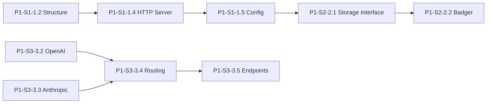

# Parallel Execution Guide for Claude Code

This guide explains how to run multiple Claude Code instances in parallel to accelerate Starport development.

## ⚠️ Critical: One Clone Per Agent

**Each agent MUST have its own Git clone** to avoid conflicts:
- Git tracks one working branch per directory
- Multiple agents in the same directory = broken branches
- Always clone separate directories for parallel work

## Quick Start

### Automatic Workspace Management

The `spawn-agent.sh` script handles all workspace setup automatically:

```bash
# Just run the spawn script - it creates separate workspaces automatically
./spawn-agent.sh P1-S1-1.1  # Creates ~/starport-development/starport-init/
./spawn-agent.sh P1-S1-1.2  # Creates ~/starport-development/starport-structure/
./spawn-agent.sh P1-S1-1.6  # Creates ~/starport-development/starport-openapi/
```

No manual cloning needed! Each task gets its own isolated workspace.

### Running Multiple Agents in Parallel

Open separate terminals and spawn agents for non-conflicting tasks:

```bash
# Terminal 1: Project Structure
./spawn-agent.sh P1-S1-1.2

# Terminal 2: OpenAPI Documentation (parallel safe)
./spawn-agent.sh P1-S1-1.6

# Terminal 3: Documentation Infrastructure (parallel safe)
./spawn-agent.sh P1-S1-1.7
```

The script will:
1. Create a unique workspace for each task
2. Clone the repository into that workspace
3. Provide complete context for the agent
4. Show the workspace location

## Dependency Management

### Parallel-Safe Task Groups

These groups can be worked on simultaneously without conflicts:

#### Subphase 1.1
- **Group A**: P1-S1-1.1, P1-S1-1.2 (Repository & Structure)
- **Group B**: P1-S1-1.6, P1-S1-1.7 (Documentation)
- **Group C**: P1-S1-1.3 (DevOps) - Can start after 1.2

#### Subphase 1.2
- **Group A**: P1-S2-2.1, P1-S2-2.3 (Interfaces & Models)  
- **Group B**: P1-S2-2.4 (API Key Management)
- **Wait for A**: P1-S2-2.2 (Badger implementation)

#### Subphase 1.3+
- **Group A**: P1-S3-3.2 (OpenAI Connector)
- **Group B**: P1-S3-3.3 (Anthropic Connector)
- **Group C**: P1-S6-6.1 (Management API)
- **Group D**: P1-S6-6.2 (CLI Implementation)

### Sequential Dependencies

These must be completed in order:



## Coordination Protocol

### 1. Daily Task Check

Each Claude Code instance should:
```markdown
1. Check TASKS.md for task status
2. Find tasks marked 🟡 Ready in your area
3. Update task to 🟢 In Progress when starting
4. Create branch: task/[TASK-ID]-description
```

### 2. PR Submission

```bash
# Consistent branch naming
git checkout -b task/P1-S2-2.1-storage-interface

# Commit with task ID
git commit -m "[P1-S2-2.1] Add storage interface abstraction"

# PR title format
[P1-S2-2.1] Storage interface abstraction with KV operations
```

### 3. Status Updates

Update TASKS.md in your PR:
```diff
-**Status**: 🟡 Ready
+**Status**: ✅ Complete
+**PR**: #123
```

## Conflict Avoidance

### 1. Package Ownership

| Package | Owner | Tasks |
|---------|-------|-------|
| internal/storage/* | Storage Team | P1-S2-* |
| internal/connector/* | API Team | P1-S3-3.2, P1-S3-3.3 |
| internal/api/* | API Team | P1-S3-*, P1-S6-* |
| .github/* | DevOps Team | P1-S1-1.3 |
| docs/* | Docs Team | All doc tasks |

### 2. Shared Files

For files that multiple teams might touch:

1. **main.go**: Only one team modifies at a time
2. **go.mod**: Coordinate dependency additions
3. **Makefile**: Add targets in separate sections
4. **README.md**: Use sections to avoid conflicts

### 3. Communication

Update the Active Work section in `TASKS.md`:
```markdown
| Team | Current Task | Branch | Status | ETA | PR |
|------|--------------|--------|--------|-----|-----|
| Storage | P1-S2-2.1 Storage Interface | task/P1-S2-2.1-storage-interface | 🟢 In Progress | 2:00 PM | - |
| API | P1-S3-3.2 OpenAI Connector | task/P1-S3-3.2-openai-connector | 🟢 In Progress | 4:00 PM | - |
```

## Testing Strategy

### 1. Isolated Unit Tests

Each PR should include tests that don't depend on other in-progress work:

```go
// Use mocks for dependencies
type mockStorage struct{}

func (m *mockStorage) Get(ctx context.Context, key string) ([]byte, error) {
    // Mock implementation
    return []byte("mock-value"), nil
}
```

### 2. Integration Tests Later

Once dependencies are merged:
```go
// +build integration

func TestFullIntegration(t *testing.T) {
    // Test with real implementations
}
```

### 3. Feature Flags

For partially complete features:
```go
if config.FeatureFlags.NewRouter {
    // Use new implementation
} else {
    // Use stub
}
```

## Example Workflow

### Day 1 - Morning
1. **Storage Team**: Starts P1-S2-2.1 (Storage Interface)
2. **API Team**: Starts P1-S3-3.2 (OpenAI Connector)  
3. **DevOps Team**: Starts P1-S1-1.3 (CI/CD Setup)
4. **Docs Team**: Starts P1-S1-1.6 (OpenAPI Foundation)

### Day 1 - Afternoon
1. **Storage Team**: Completes 2.1, starts P1-S2-2.3 (Models)
2. **API Team**: Continues on OpenAI connector
3. **DevOps Team**: Sets up GitHub Actions
4. **Docs Team**: Creates documentation structure

### Day 2
1. **Storage Team**: Starts P1-S2-2.2 (Badger) - now unblocked
2. **API Team**: Completes OpenAI, starts Anthropic
3. **DevOps Team**: Adds Docker setup
4. **Docs Team**: Begins API documentation

## Monitoring Progress

### 1. Task Board

Create a simple dashboard in `STATUS.md`:
```markdown
# Sprint Status

## Subphase 1.1
- ✅ P1-S1-1.1 Repository Init (#1)
- 🟢 P1-S1-1.2 Structure Setup (@storage-team)
- 🟢 P1-S1-1.3 DevOps Setup (@devops-team)
- 🟡 P1-S1-1.4 HTTP Server
- 🔴 P1-S1-1.5 Config (blocked by 1.4)
```

### 2. Daily Updates

Each team updates their status:
```bash
# At start of day
echo "## Storage Team - $(date)
- Starting: P1-S2-2.1
- Blocked by: None
" >> DAILY-LOG.md

# At end of day
echo "- Completed: P1-S2-2.1 (PR #123)
- Tomorrow: P1-S2-2.2
" >> DAILY-LOG.md
```

## Tips for Maximum Efficiency

1. **Start with interfaces**: Define contracts before implementations
2. **Use mocks liberally**: Don't wait for dependencies
3. **Small, focused PRs**: Easier to review and merge
4. **Communicate blockers**: Don't wait silently
5. **Update status frequently**: Keep the team informed

## Troubleshooting

### Merge Conflicts
```bash
# Always sync before starting work
git checkout main
git pull origin main
git checkout -b task/new-task

# Rebase if conflicts arise
git fetch origin
git rebase origin/main
```

### Dependency Issues
- Use go.work for local development
- Mock external dependencies
- Use feature flags for partial implementations

### Communication Breakdown
- Update TASKS.md frequently
- Use PR comments for discussions
- Tag team members when blocked

---

With this setup, 4 Claude Code instances can work in parallel, potentially completing a subphase's worth of tasks in 1-2 days!