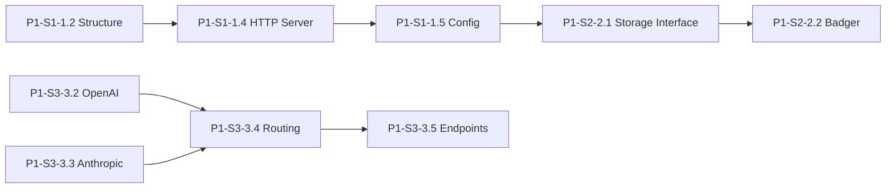

# Parallel Execution Guide for Claude Code

This guide explains how to run multiple Claude Code instances in parallel to accelerate Starport development.

## Quick Start

### 1. Setup Multiple Workspaces

```bash
# Create a parent directory for all workspaces
mkdir starport-development
cd starport-development

# Clone multiple instances
git clone https://github.com/agentstation/starport workspace-storage
git clone https://github.com/agentstation/starport workspace-api  
git clone https://github.com/agentstation/starport workspace-devops
git clone https://github.com/agentstation/starport workspace-docs
```

### 2. Assign Work Streams

Each Claude Code instance should focus on a specific area:

| Workspace | Focus Area | Task Pattern | Example Tasks |
|-----------|------------|--------------|---------------|
| workspace-storage | Storage & Data | P1-S2-* | Storage interfaces, Badger, Valkey |
| workspace-api | API & Connectors | P1-S3-*, P1-S6-* | OpenAI/Anthropic connectors, endpoints |
| workspace-devops | Infrastructure | P1-S1-1.3, P1-S5-* | CI/CD, Docker, Kubernetes |
| workspace-docs | Documentation | P1-S1-1.6, P1-S1-1.7 | OpenAPI, guides, SDKs |

### 3. Launch Claude Code Instances

Open separate terminals for each workspace:

```bash
# Terminal 1 - Storage Team
cd workspace-storage
claude-code --context "You are working on storage components. Focus on tasks P1-S2-*. Check TASKS.md for available storage tasks."

# Terminal 2 - API Team  
cd workspace-api
claude-code --context "You are working on API and connector components. Focus on tasks P1-S3-* and P1-S6-*. Check TASKS.md for API tasks."

# Terminal 3 - DevOps Team
cd workspace-devops  
claude-code --context "You are working on DevOps and infrastructure. Focus on CI/CD, Docker, and deployment tasks. Check TASKS.md."

# Terminal 4 - Documentation Team
cd workspace-docs
claude-code --context "You are working on documentation and SDKs. Focus on OpenAPI specs and developer guides. Check TASKS.md."
```

## Dependency Management

### Parallel-Safe Task Groups

These groups can be worked on simultaneously without conflicts:

#### Subphase 1.1
- **Group A**: P1-S1-1.1, P1-S1-1.2 (Repository & Structure)
- **Group B**: P1-S1-1.6, P1-S1-1.7 (Documentation)
- **Group C**: P1-S1-1.3 (DevOps) - Can start after 1.2

#### Subphase 1.2
- **Group A**: P1-S2-2.1, P1-S2-2.3 (Interfaces & Models)  
- **Group B**: P1-S2-2.4 (API Key Management)
- **Wait for A**: P1-S2-2.2 (Badger implementation)

#### Subphase 1.3+
- **Group A**: P1-S3-3.2 (OpenAI Connector)
- **Group B**: P1-S3-3.3 (Anthropic Connector)
- **Group C**: P1-S6-6.1 (Management API)
- **Group D**: P1-S6-6.2 (CLI Implementation)

### Sequential Dependencies

These must be completed in order:



## Coordination Protocol

### 1. Daily Task Check

Each Claude Code instance should:
```markdown
1. Check TASKS.md for task status
2. Find tasks marked 🟡 Ready in your area
3. Update task to 🟢 In Progress when starting
4. Create branch: task/[TASK-ID]-description
```

### 2. PR Submission

```bash
# Consistent branch naming
git checkout -b task/P1-S2-2.1-storage-interface

# Commit with task ID
git commit -m "[P1-S2-2.1] Add storage interface abstraction"

# PR title format
[P1-S2-2.1] Storage interface abstraction with KV operations
```

### 3. Status Updates

Update TASKS.md in your PR:
```diff
-**Status**: 🟡 Ready
+**Status**: ✅ Complete
+**PR**: #123
```

## Conflict Avoidance

### 1. Package Ownership

| Package | Owner | Tasks |
|---------|-------|-------|
| internal/storage/* | Storage Team | P1-S2-* |
| internal/connector/* | API Team | P1-S3-3.2, P1-S3-3.3 |
| internal/api/* | API Team | P1-S3-*, P1-S6-* |
| .github/* | DevOps Team | P1-S1-1.3 |
| docs/* | Docs Team | All doc tasks |

### 2. Shared Files

For files that multiple teams might touch:

1. **main.go**: Only one team modifies at a time
2. **go.mod**: Coordinate dependency additions
3. **Makefile**: Add targets in separate sections
4. **README.md**: Use sections to avoid conflicts

### 3. Communication

Create a `COORDINATION.md` file in the repo:
```markdown
# Current Work

## Storage Team
- Working on: P1-S2-2.1
- Branch: task/P1-S2-2.1-storage-interface
- ETA: 2 hours

## API Team  
- Working on: P1-S3-3.2
- Branch: task/P1-S3-3.2-openai-connector
- ETA: 4 hours
```

## Testing Strategy

### 1. Isolated Unit Tests

Each PR should include tests that don't depend on other in-progress work:

```go
// Use mocks for dependencies
type mockStorage struct{}

func (m *mockStorage) Get(ctx context.Context, key string) ([]byte, error) {
    // Mock implementation
    return []byte("mock-value"), nil
}
```

### 2. Integration Tests Later

Once dependencies are merged:
```go
// +build integration

func TestFullIntegration(t *testing.T) {
    // Test with real implementations
}
```

### 3. Feature Flags

For partially complete features:
```go
if config.FeatureFlags.NewRouter {
    // Use new implementation
} else {
    // Use stub
}
```

## Example Workflow

### Day 1 - Morning
1. **Storage Team**: Starts P1-S2-2.1 (Storage Interface)
2. **API Team**: Starts P1-S3-3.2 (OpenAI Connector)  
3. **DevOps Team**: Starts P1-S1-1.3 (CI/CD Setup)
4. **Docs Team**: Starts P1-S1-1.6 (OpenAPI Foundation)

### Day 1 - Afternoon
1. **Storage Team**: Completes 2.1, starts P1-S2-2.3 (Models)
2. **API Team**: Continues on OpenAI connector
3. **DevOps Team**: Sets up GitHub Actions
4. **Docs Team**: Creates documentation structure

### Day 2
1. **Storage Team**: Starts P1-S2-2.2 (Badger) - now unblocked
2. **API Team**: Completes OpenAI, starts Anthropic
3. **DevOps Team**: Adds Docker setup
4. **Docs Team**: Begins API documentation

## Monitoring Progress

### 1. Task Board

Create a simple dashboard in `STATUS.md`:
```markdown
# Sprint Status

## Subphase 1.1
- ✅ P1-S1-1.1 Repository Init (#1)
- 🟢 P1-S1-1.2 Structure Setup (@storage-team)
- 🟢 P1-S1-1.3 DevOps Setup (@devops-team)
- 🟡 P1-S1-1.4 HTTP Server
- 🔴 P1-S1-1.5 Config (blocked by 1.4)
```

### 2. Daily Updates

Each team updates their status:
```bash
# At start of day
echo "## Storage Team - $(date)
- Starting: P1-S2-2.1
- Blocked by: None
" >> DAILY-LOG.md

# At end of day
echo "- Completed: P1-S2-2.1 (PR #123)
- Tomorrow: P1-S2-2.2
" >> DAILY-LOG.md
```

## Tips for Maximum Efficiency

1. **Start with interfaces**: Define contracts before implementations
2. **Use mocks liberally**: Don't wait for dependencies
3. **Small, focused PRs**: Easier to review and merge
4. **Communicate blockers**: Don't wait silently
5. **Update status frequently**: Keep the team informed

## Troubleshooting

### Merge Conflicts
```bash
# Always sync before starting work
git checkout main
git pull origin main
git checkout -b task/new-task

# Rebase if conflicts arise
git fetch origin
git rebase origin/main
```

### Dependency Issues
- Use go.work for local development
- Mock external dependencies
- Use feature flags for partial implementations

### Communication Breakdown
- Update COORDINATION.md frequently
- Use PR comments for discussions
- Tag team members when blocked

---

With this setup, 4 Claude Code instances can work in parallel, potentially completing a subphase's worth of tasks in 1-2 days!