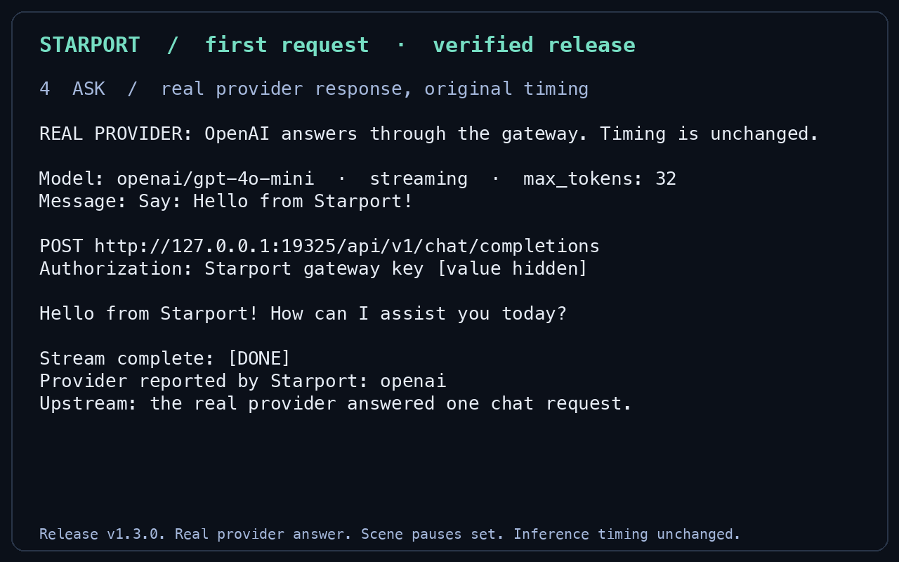
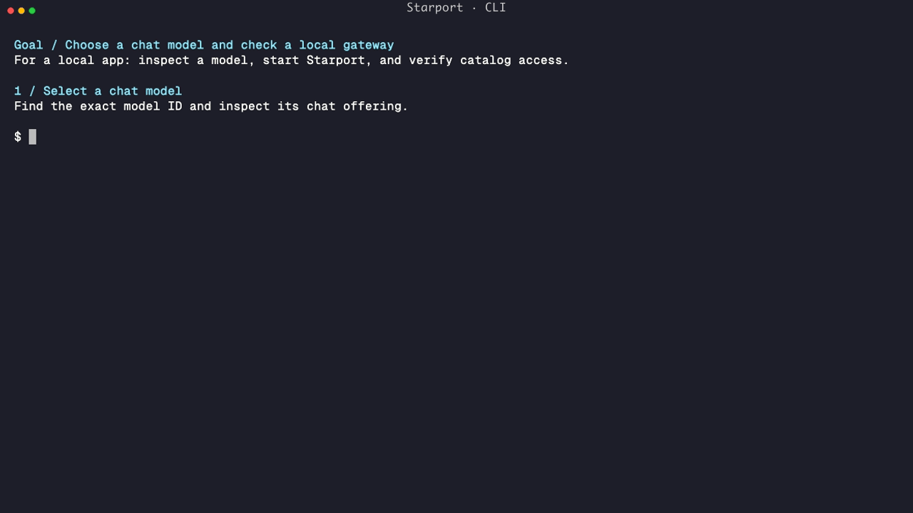
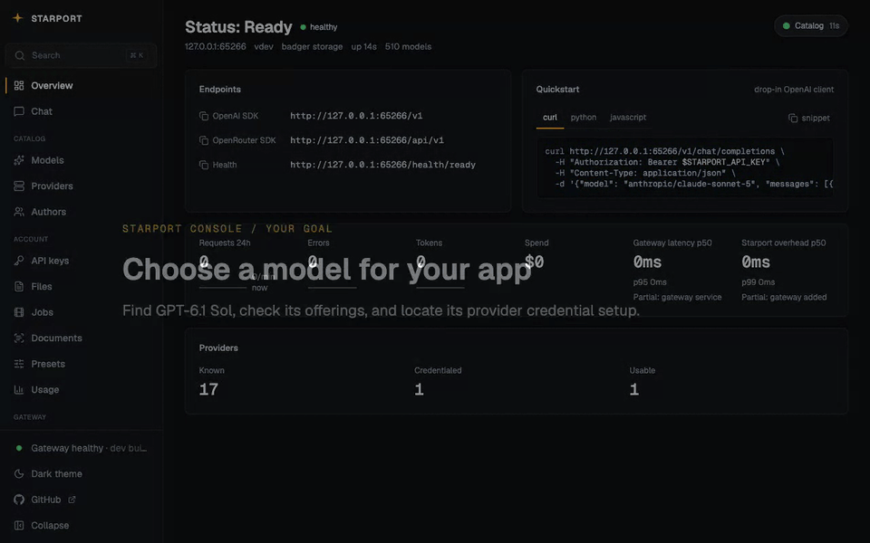
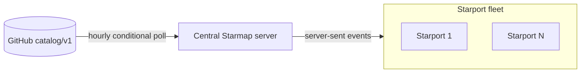

# Starport

[](https://github.com/agentstation/starport/releases)
[](https://github.com/agentstation/starport/actions/workflows/ci.yml)
[](LICENSE)

Starport is a self-hosted LLM inference gateway in one binary. It serves the
OpenAI-compatible API at `/v1` and the OpenRouter-compatible API at `/api/v1`.
One Starmap catalog generation gives it every provider, model, capability,
context, and price fact.

[](docs/assets/first-use-v1.3.0/first-use.gif)

[Watch the 41-second first request](docs/assets/first-use-v1.3.0/first-use.gif)
or read the [transcript and reproduction steps](docs/assets/first-use-v1.3.0/TRANSCRIPT.md).
The recording uses release v1.3.0 and a real provider. It shortens the credential-entry wait and preserves inference timing.
The static preview does not autoplay.

Starport serves individual developers, startups, and enterprises:

- An individual developer runs one command and gets an isolated gateway, a
  console, and one temporary gateway API key.
- A startup keeps its OpenAI and OpenRouter clients and changes one base URL.
- An enterprise adds shared provider inference credentials, BYOK policy,
  budgets, rate limits, encrypted credential storage, and secret references.

## CLI and Console

The recordings below use current source and show catalog inspection and a temporary gateway.
The CLI uses the reviewed local Starmap catalog embedded in its source build.
The Console reads that generation from a local Starmap server.
Neither recording uses provider inference credentials.
Each recording starts with a goal and ends with its result and next step.
Short chapter titles introduce each action, and the results pause for reading.

The first-request recording above proves inference with release v1.3.0.

**CLI:** choose a model and verify an authenticated local gateway before configuring inference.
Search the catalog, inspect the model, start the gateway, and read its catalog API.
The ending identifies the provider credential and client settings needed for inference.



[Animated SVG](docs/assets/cli-current/cli.svg),
[video](docs/assets/cli-current/cli.mp4),
[static preview](docs/assets/cli-current/poster.png), and
[transcript and reproduction steps](docs/assets/cli-current/TRANSCRIPT.md).

**Console:** choose a model and find the credential setup for its provider.
Check the current catalog, find `gpt-6.1-sol`, and inspect its capabilities and offerings.
Follow its OpenAI offering and open the empty shared credential form.
The ending states the missing credential and the next step.



[Video](docs/assets/console-demo/console.mp4),
[static preview](docs/assets/console-demo/poster.png), and
[transcript and reproduction steps](docs/assets/console-demo/TRANSCRIPT.md).
The website Console scene uses this video with playback controls.

## Install

Supported targets are macOS on Apple silicon, Linux on x86-64 and ARM64, and Windows on x86-64 and ARM64.
New releases do not support Intel Macs. Historical Intel Mac archives remain available.

Install the released cask on macOS or Linux:

```bash
brew trust --cask agentstation/tap/starport
brew install --cask agentstation/tap/starport
starport --version
```

Homebrew 6 requires package trust. See [Homebrew tap trust](https://docs.brew.sh/Tap-Trust).
Use `brew install` for the first installation. To upgrade an installed cask:

```bash
brew update
brew upgrade --cask agentstation/tap/starport
```

The current public release also contains checksummed archives for macOS,
Linux, and Windows. Download an archive from
[GitHub Releases](https://github.com/agentstation/starport/releases).

CI tests each candidate archive on a native runner for each supported target.
The job checks the checksum and the version and runs the two catalog commands below.
It also starts a temporary gateway and stops it.

To build from source, install Go 1.27.2 and pnpm 11.22.0.

Starport and Starmap use the same exact Go version for development, CI, and releases.
Qualify future upgrades across both repositories and update their pins together.
Then run:

```bash
git clone https://github.com/agentstation/starport.git
cd starport
make build
./starport --version
```

## Quick start

The quick start uses `starport dev`, a temporary gateway. It keeps no state
after it stops. [Keep the gateway](#keep-the-gateway) gives the persistent path.

### Inspect the catalog without credentials

Inspect the embedded catalog before you start a gateway or set a credential:

```bash
starport models search gpt-4o --json
starport models show openai/gpt-4o-mini --json
```

These commands need no credential or network access.
Catalog presence does not prove that a provider will accept an inference request.

### Credential roles

Starport uses three credential roles. They are not interchangeable:

1. A **gateway API key** (`STARPORT_API_KEY` below) authenticates a client to
   Starport. It carries the scopes and limits of the client.
2. A **provider inference credential** (`OPENAI_API_KEY` below) pays a provider
   for inference.
3. A **catalog-acquisition credential** (`STARPORT_CATALOG_SOURCE_API_KEY`)
   lets Starport read a private catalog source. It never pays a provider.

A gateway API key never pays a provider. A provider inference credential never
authenticates a client. See [Keys and roles](docs/site/start/keys-and-roles.md).

### Terminal 1: start a temporary gateway

Starport checks every provider in the active catalog generation. It discovers
provider inference credentials from the ordered profiles in that catalog. You
do not select a provider with a command flag.

Set one conventional provider inference credential. This example uses OpenAI:

```bash
unset STARPORT_CATALOG_STATE_DIR STARPORT_FILES_BACKEND
export OPENAI_API_KEY="replace-with-provider-inference-key"
starport dev
```

The command starts a temporary development gateway at `http://127.0.0.1:8080`.
It uses in-memory state for Badger and SQLite and creates no configuration files.
It prints one temporary Starport gateway API key and opens the console:

```text
Starport development gateway
URL: http://127.0.0.1:8080
Authentication: required
Gateway API key (shown once): replace-with-generated-gateway-key
Console (one-time launch link): http://127.0.0.1:8080/launch?lt=replace-with-ticket
```

The console link is not a key. The gateway spends the link on first use and
exchanges it for a browser session that this machine issued. You paste nothing
into the browser. Add `--no-open` to print the link instead, for a machine that
you reach over SSH. `starport ui` opens a new link at any time.

A browser on the gateway machine can also present its local admin token.
`starport auth token --copy` puts the token on the clipboard of the gateway
machine. Both paths prove presence at that machine and end in the same console
session.

Development mode reads the process environment but not `config.env`.
It refuses persistent storage selectors before it opens storage.
The refused selectors are the KV, SQL, file, and cache backend settings, and `STARPORT_CATALOG_STATE_DIR`.
The `unset` command above removes two common selectors.
See [Temporary development](docs/site/start/temporary-development.md) for the full list.

Keep this terminal open.

### Terminal 2: send a request with the gateway key

Copy the printed gateway key into a second terminal. This key authenticates the
client to Starport. It is not the provider inference credential.

```bash
export STARPORT_API_KEY="replace-with-generated-gateway-key"
```

Readiness is independent of provider credentials. A ready response means that
the gateway can accept requests. The authenticated model response contains the
current Starmap catalog view.

```bash
curl --fail http://127.0.0.1:8080/health/ready
curl --fail-with-body \
  -H "Authorization: Bearer $STARPORT_API_KEY" \
  http://127.0.0.1:8080/api/v1/models
```

Send an OpenRouter-style chat request:

```bash
curl --no-buffer --fail-with-body \
  -H "Authorization: Bearer $STARPORT_API_KEY" \
  -H "Content-Type: application/json" \
  -d '{"model":"openai/gpt-4o-mini","max_tokens":32,"stream":true,"messages":[{"role":"user","content":"Hello"}]}' \
  http://127.0.0.1:8080/api/v1/chat/completions
```

Starport streams the answer as server-sent events. Each `data:` line carries a
chat completion chunk with part of the answer. The last line is `data: [DONE]`.

The first provider request proves whether the provider accepts the resolved
credential and whether the account can use the selected offering. Starport
records authentication, permission, quota, billing, rate-limit, and service
failures in its scoped provider state.

### Stop the temporary gateway

Press Ctrl+C in Terminal 1. At shutdown, `starport dev` removes these items:

- The gateway API keys, accounts, and console sessions.
- The usage records, request activity, and budgets.
- The uploaded files, batches, and presets.
- The catalog baseline and the runtime catalog state in the session scratch directories.

Provider inference credentials stay in the process environment. A later
development run removes abandoned scratch directories after it verifies their
owner. See [development scratch recovery](docs/OPERATOR-GUIDE.md#development-scratch-recovery).

A development gateway has no upgrade path to persistent state. To keep data,
follow [Run a persistent local gateway](docs/site/start/local-persistent.md).

## Connect a client

Change the base URL of an existing client, and use a Starport gateway API key
as its API key.

| Client contract | Base URL |
| --- | --- |
| OpenAI | `http://127.0.0.1:8080/v1` |
| OpenRouter | `http://127.0.0.1:8080/api/v1` |

OpenAI Python example:

```python
import os

from openai import OpenAI

client = OpenAI(
    base_url="http://127.0.0.1:8080/v1",
    api_key=os.environ["STARPORT_API_KEY"],
)

response = client.chat.completions.create(
    model="openai/gpt-4o-mini",
    messages=[{"role": "user", "content": "Hello"}],
)
```

For an OpenRouter client, replace its default base URL with
`http://127.0.0.1:8080/api/v1`. Keep the client request and response types.

The compatibility boundary is the tested routes and SDK versions.
[Connect an SDK](docs/site/api-compatibility/sdks.md) lists the SDK versions
that `scripts/smoke-openrouter-sdks.sh` tests.
[API surfaces](docs/site/api-compatibility/surfaces.md) lists the routes.
Starport uses direct changes and has no legacy provider aliases or storage
readers. It does not yet promise a compatibility window.

## Keep the gateway

### Persistent local gateway

For persistent local state, run `starport serve`. On an empty local root, the
first run creates the configuration file, a Starport master key, the first
gateway identity, and the local admin token. Then it starts the gateway. The
first run prints the gateway API key once, before the welcome. Initialization
does not select a provider or persist provider inference credentials.
[Run a persistent local gateway](docs/site/start/local-persistent.md) gives the
complete procedure.

```bash
starport serve
```

The first identity has the name `local-admin`. To select a different name, run
`starport init` once before the first `starport serve`:

```bash
starport init --name primary-admin
```

On a default macOS installation, the output has this form:

```text
Initialized Starport.
Configuration: /Users/<user>/Library/Application Support/starport/config/config.env
Data: /Users/<user>/Library/Application Support/starport/data
Gateway API key (shown once): replace-with-generated-gateway-key
Run: starport serve
```

Then start the gateway with `starport serve`. In both sequences, open the
console with `starport ui`. Issue further gateway API keys in the console under
Keys.

`starport config paths` prints each managed location on one labeled line:

```text
Configuration directory: /Users/<user>/Library/Application Support/starport/config
Configuration file: /Users/<user>/Library/Application Support/starport/config/config.env
Data directory: /Users/<user>/Library/Application Support/starport/data
State directory: /Users/<user>/Library/Application Support/starport/state
Cache directory: /Users/<user>/Library/Caches/starport
```

`STARPORT_HOME` is the shared path anchor. It puts the configuration, data,
state, and cache roots under one directory. `STARPORT_CONFIG_DIR` moves only
the configuration root. See [Files and paths](docs/site/configure/paths.md).

Badger holds the durable KV records, for example keys, usage, and accepted
catalog generations. SQLite holds the relational records. Ristretto holds
disposable memory caches. A cache never holds durable state. See
[Storage backends](docs/site/storage/backends.md) and
[Optional caches](docs/site/storage/caches.md).

### Serve without a gateway API key

Starport requires a gateway API key by default. Add `--no-auth` to
`starport dev` or `starport serve` to serve open. Open service fits a
workstation, a private container, or a test rig. The console offers the same
switch under Settings. You can close an open gateway again from the machine
that runs it.

Starport refuses `--no-auth` on an address the network can reach unless you
also pass `--allow-remote-no-auth`. See
[Authentication mode](docs/OPERATOR-GUIDE.md#authentication-mode).

### Team and enterprise deployment

Pull a versioned image and verify its GitHub attestation:

```bash
STARPORT_VERSION="$(gh release view \
  --repo agentstation/starport \
  --json tagName \
  --jq '.tagName | ltrimstr("v")')"
docker pull "ghcr.io/agentstation/starport:$STARPORT_VERSION"
gh attestation verify "oci://ghcr.io/agentstation/starport:$STARPORT_VERSION" \
  --repo agentstation/starport \
  --signer-workflow agentstation/starport/.github/workflows/release.yaml
docker run --rm "ghcr.io/agentstation/starport:$STARPORT_VERSION" --version
```

The default Compose file builds one Starport process with persistent Badger,
SQLite, and file storage. Use fresh volumes for this recipe. See the
[container procedure](docs/OPERATOR-GUIDE.md#container-start) before changing an
existing deployment.

```bash
cp .env.example .env
chmod 600 .env
# Edit .env. Set STARPORT_SECURITY_MASTER_KEY and OPENAI_API_KEY.
docker compose build starport
docker compose run --rm starport init --configured-storage --name primary-admin
docker compose run --rm starport auth rotate
docker compose up -d starport
```

Save the gateway key from initialization and the local admin token from rotation.
Keep both values private. Do not initialize the same identity repository again.
The API is available at `http://127.0.0.1:8080`. The three named volumes retain
configuration, application data, and catalog state through container replacement.
Back up all three volumes and the master key.

Run one process with this recipe. Several replicas need the
[replicated recipe: Valkey, PostgreSQL, shared blob bytes, and private replica state](docs/site/architecture/recipes.md#t4-replicated-starport).
That recipe needs all four parts together. A new service selector or database
connection does not move existing records.
The [target table](docs/site/architecture/targets.md#target-table) gives the
status of each deployment target.
Review [current production limits](docs/PRODUCTION-STATUS.md) before you deploy several replicas.

Local Ollama inference needs no credential. Add each installed model to a
reviewed Starmap workspace, and set `STARPORT_CATALOG_WORKSPACE_PATH` before
startup.

See the [operator guide](docs/OPERATOR-GUIDE.md#initialize-persistent-state)
for the complete persistent and production procedures.

## Configuration

Starport reads `config.env` from the configuration root. Process environment
variables override the file. `starport config paths` prints the resolved paths.

`starport config show` prints the effective schema and hides secret values.
`starport doctor` runs passive checks. Add `--probe` for read-only storage and
identity checks.

Provider IDs, credential fields, conventional environment names, defaults,
authentication profiles, and endpoints come from the active Starmap catalog.
For example, Starport checks `OPENAI_API_KEY` before
`STARPORT_OPENAI_API_KEY`. A provider that uses an already compiled transport
and authentication primitive needs no Starport provider switch.

Starport resolves all catalog providers at startup and, by default, reconciles
them every minute. Set `STARPORT_CREDENTIAL_SOURCES_RECONCILE_INTERVAL` to
change that interval. An administrator can also trigger the same shared work:

```bash
curl --fail-with-body \
  -X POST \
  -H "Authorization: Bearer $STARPORT_API_KEY" \
  http://127.0.0.1:8080/api/v1/admin/providers/refresh
```

Another process cannot change Starport's process environment. Restart Starport
after you change an environment value. File and remote secret sources can
return new material during interval or manual reconciliation.

Add `_REFERENCE` to the catalog-derived Starport name to select a direct secret
source. Starport supports Google Cloud Secret Manager, Azure Key Vault, AWS
Secrets Manager, HashiCorp Vault KV v2, and OpenBao KV v2. For example:

```bash
export STARPORT_OPENAI_API_KEY_REFERENCE='aws-secrets-manager:starport/openai#api-key'
```

The [operator guide](docs/OPERATOR-GUIDE.md#direct-secret-sources) defines the
resource syntax, source authentication, version selection, and fallback rule.

### Catalog topology

Starport reads one connected Starmap runtime. `STARPORT_CATALOG_SOURCE` names
the kind, and the kind decides the egress, the freshness age, and the request
budget. The default `public` kind follows the published GitHub channel, which
suits one gateway and a small fleet. A larger fleet, or a fleet that reaches no
GitHub address, uses a central Starmap server instead. The central server holds
the single egress to GitHub and pushes each publication to the replicas.



```bash
export STARPORT_CATALOG_SOURCE="starmap"
export STARPORT_CATALOG_SOURCE_URL="https://catalog.example.com/api/v1"
export STARPORT_CATALOG_SOURCE_API_KEY="replace-if-the-server-requires-one"
```

`STARPORT_CATALOG_SOURCE_API_KEY` is a catalog-acquisition credential. It never
pays a provider. Each gateway keeps its last accepted generation for restart
and recovery. [Deployment topologies](docs/DEPLOYMENT-TOPOLOGIES.md) gives the
five topologies, their request budgets, and the thresholds that move a fleet to
a central Starmap server.

See the [configuration reference](.env.example) and
[operator guide](docs/OPERATOR-GUIDE.md) for production settings.

### Cloud credentials

Vertex AI and Azure OpenAI can use renewable default cloud credentials. Their
project, location, and endpoint fields use the conventional names declared by
Starmap:

```bash
export GOOGLE_CLOUD_PROJECT="replace-with-project-id"
export GOOGLE_CLOUD_LOCATION="us-central1"

export AZURE_OPENAI_ENDPOINT="https://replace-with-resource.openai.azure.com"
```

Vertex AI uses Google Application Default Credentials. Azure OpenAI uses
`AZURE_OPENAI_API_KEY` when present. Without it, Azure OpenAI uses
`DefaultAzureCredential`. Starport gets renewable bearer tokens before an
inference request uses them.

Starmap catalog-acquisition credentials remain separate from Starport
inference credentials.

## Features

Version 1 includes:

- Chat completions, streaming chat, embeddings, and model discovery.
- The Responses API at `/v1/responses` on the same chat contract.
- Moderations at `/v1/moderations` and gateway-executed batches at `/v1/batches`.
- Exact provider and model routing with fallback and `openrouter/auto`.
- Provider routing preferences: order, sort, price caps, and model variants.
- Presets with `@preset/` model references, immutable revisions, and rollback.
- Catalog-driven providers over the compiled OpenAI, Anthropic, Google Cloud,
  Google AI Studio, and Ollama transport primitives.
- Encrypted provider credentials, renewable cloud credentials, and direct
  secret-source references.
- Header-only gateway authentication, per-key rate limits, per-key budgets,
  and allowed-model limits.
- Team budgets, refused before the provider call.
- Guardrails that redact or refuse, detect payment cards under Luhn, and
  fail closed.
- Request logs and usage accounting with catalog-priced costs at
  `/api/v1/activity`.
- Prometheus metrics at `/metrics`, optional OTLP trace export, and NDJSON
  usage export.
- An admin audit log. Every admin mutation writes an actor-attributed
  record, and the console renders the log.
- Signed webhooks for budget, job, and provider-health transitions.
- An agent surface: the catalog verbs answer offline with `--json`, and
  `starport agent setup` installs the embedded skill.
- An embedded web console. Its pages cover the overview, chat with model
  comparison, models, providers with incident history, usage, presets, keys,
  files, and settings.
- A file store at `/v1/files` that keeps a document for a later chat request.
  It writes to a local filesystem or an S3-compatible bucket.
- A `file-parser` plugin that reads an attached document before the chat model
  sees it. The `native` engine reads a text layer in process and charges
  nothing. The `recognition` engine sends a scanned page to a catalog model
  that serves `documents-recognition`, and the record reports what the pages
  cost.
- Reranking at `/v1/rerank` and `/api/v1/rerank`, which scores a document list
  against one query. It needs the `rerank:write` scope, and Starmap owns the
  offerings, the billing basis, and the price.
- Account-safe response caching, with an opt-in semantic cache beside the
  exact identity.
- Badger storage for one process and Valkey storage for multiple processes.

## Performance

The [performance profile](docs/performance-targets-v1.json) defines the
latency targets for the planned production release. The profile marks these
targets UNVERIFIED. CSP22 owns their qualification on dedicated runners.
[Gateway overhead](docs/PERFORMANCE.md) gives the measurement boundaries.

The current overhead benchmark guards one part of chat request processing.
It does not establish complete gateway latency or a production p99 limit.

## Develop

```bash
make deps
make check
bash scripts/smoke-first-run.sh
bash scripts/smoke-openrouter-sdks.sh
```

`make check` reads files but does not change them. Use `make format` or
`make tidy` when you want to change source or module files.

See the [development guide](DEVELOPMENT.md) and
[contribution guide](docs/CONTRIBUTING.md).

## Documentation

- [Architecture](docs/ARCHITECTURE.md)
- [Operator guide](docs/OPERATOR-GUIDE.md)
- [Deployment topologies](docs/DEPLOYMENT-TOPOLOGIES.md)
- [Security posture](docs/SECURITY-POSTURE.md)
- [Performance methodology](docs/PERFORMANCE.md)
- [Vertex AI configuration](docs/VERTEX_AI_CONFIG.md)
- [Model catalog contract](MODELS.md)
- [Documentation index](docs/README.md)

## License and security

Starport uses the GNU AGPLv3 license. See [LICENSE](LICENSE).

Report vulnerabilities through the process in [SECURITY.md](SECURITY.md).
For credential handling, encryption, and data flows, read the
[security posture](docs/SECURITY-POSTURE.md).
