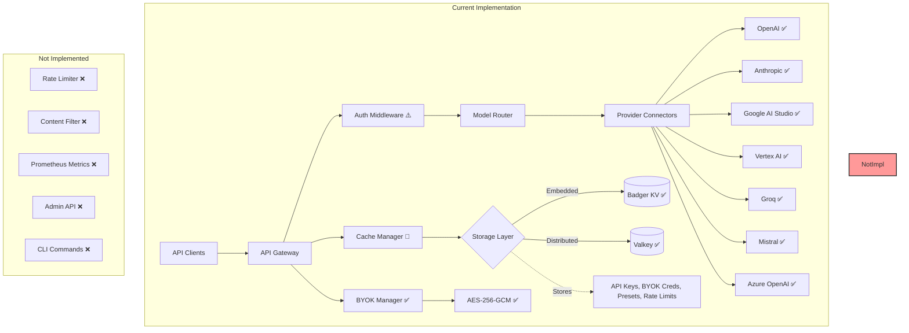

# Starport Architecture

**Summary**  
Starport is a high-performance, open-source LLM gateway built in Go that provides unified access to multiple model providers with sub-millisecond latency overhead. The current implementation includes complete provider integration for 6 major LLM providers, full OpenAI/OpenRouter API compatibility, advanced routing with circuit breakers, and BYOK support with encryption. The storage layer supports both embedded Badger (zero dependencies) and Valkey/Redis for distributed deployments. Critical features like authentication, caching, and rate limiting are partially implemented and need completion before production use.

## 1. Current Implementation Status

### ✅ Fully Implemented
- **HTTP Server**: Chi router with middleware, health checks, graceful shutdown
- **Configuration**: Environment-based config with validation and hot reload
- **Storage Layer**: Complete KVStore interface with Badger and Valkey implementations
- **Provider Connectors**: All 6 providers (OpenAI, Anthropic, Google AI Studio, Vertex AI, Groq, Mistral, Azure)
- **API Endpoints**: Both OpenAI (`/v1`) and OpenRouter (`/api/v1`) compatible endpoints
- **Model Routing**: Smart routing with fallback chains, circuit breakers, sticky sessions
- **BYOK Support**: Encrypted credential storage with 5% pricing model
- **Provider Metadata**: Dynamic model fetching, pricing information, provider listings

### 🚧 Partially Implemented
- **Authentication**: Middleware exists but is broken (treats API key as ID instead of hash lookup)
- **Caching**: Interface and structure defined, but no actual cache implementation
- **Rate Limiting**: Models and storage exist, but no enforcement middleware

### ❌ Not Implemented
- **Content Filtering**: No implementation
- **Preset Management**: Model exists but no API endpoints
- **Observability**: Basic health endpoint only, no metrics or tracing
- **Management API**: No admin endpoints for configuration
- **CLI Commands**: Only basic serve and version commands

## 2. Core Architecture Overview



## 3. Directory Structure (Actual)

```
starport/
├── cmd/starport/              # Single binary entry point
│   ├── main.go               # Minimal main function
│   ├── start.go              # Signal handling
│   └── run.go                # Application setup & CLI
├── internal/                  # Private application code
│   ├── apikey/               # API key management and validation ✅
│   ├── app/                  # Application lifecycle ✅
│   ├── providers/            # Provider key management (includes BYOK) ✅
│   ├── cache/                # Cache manager (interface only) 🚧
│   ├── config/               # Configuration system ✅
│   ├── models/               # Data models (presets, provider keys, etc.) ✅
│   ├── providers/            # Provider implementations
│   │   ├── connectors/       # LLM provider connectors ✅
│   │   └── registry/         # Connector registry ✅
│   ├── routing/              # Model routing logic ✅
│   ├── server/               # HTTP server & handlers ✅
│   └── storage/              # Storage abstraction ✅
├── pkg/enterprise/           # Enterprise interfaces (empty) ❌
├── Makefile                  # Build automation ✅
├── docker-compose.yml        # Local development ✅
└── .github/workflows/        # CI/CD pipeline ✅
```

## 4. Key Implementation Details

### 4.1 Storage Architecture

The storage layer is fully implemented with a clean interface:

```go
type KVStore interface {
    // Basic operations
    Get(ctx context.Context, key string) ([]byte, error)
    Set(ctx context.Context, key string, value []byte) error
    Delete(ctx context.Context, key string) error
    Exists(ctx context.Context, key string) (bool, error)
    
    // TTL operations (for rate limiting)
    SetWithTTL(ctx context.Context, key string, value []byte, ttl time.Duration) error
    GetTTL(ctx context.Context, key string) (time.Duration, error)
    
    // Atomic operations
    Increment(ctx context.Context, key string, delta int64) (int64, error)
    CompareAndSwap(ctx context.Context, key string, old, new []byte) error
    
    // Batch operations
    BatchGet(ctx context.Context, keys []string) (map[string][]byte, error)
    BatchSet(ctx context.Context, items map[string][]byte) error
    BatchDelete(ctx context.Context, keys []string) error
    
    // Advanced features
    Scan(ctx context.Context, pattern string, limit int) ([]string, error)
    Watch(ctx context.Context, keys []string) (<-chan WatchEvent, error)
    Subscribe(ctx context.Context, channels ...string) (PubSub, error)
    Publish(ctx context.Context, channel string, message []byte) error
    
    // Lifecycle
    Close() error
}
```

### 4.2 Provider Integration

All providers implement a common interface with full streaming support:

```go
type Connector interface {
    // Chat completion with streaming
    Chat(ctx context.Context, req *ChatRequest) (*ChatResponse, error)
    ChatStream(ctx context.Context, req *ChatRequest) (ChatStream, error)
    
    // Embeddings (not all providers support this)
    Embeddings(ctx context.Context, req *EmbeddingsRequest) (*EmbeddingsResponse, error)
    
    // Model information
    Models(ctx context.Context) (*ModelsResponse, error)
    
    // Health check
    Health(ctx context.Context) error
}
```

### 4.3 Routing System

The routing system is fully implemented with advanced features:

```go
type ModelRouter struct {
    providers      map[string]Provider
    routingConfig  RoutingConfig
    healthTracker  *HealthTracker
    latencyTracker *LatencyTracker
    stickySession  *StickySessionManager
}

// Features implemented:
// - Model-based routing (provider/model format)
// - Fallback chains with configurable retry
// - Circuit breaker per provider
// - Latency-based routing with EMA
// - Cost-aware routing
// - Sticky sessions for conversation continuity
// - Provider preferences (order, only, ignore)
```

### 4.4 BYOK Implementation

BYOK is fully implemented with security best practices:

```go
type BYOKManager struct {
    store        storage.KVStore
    masterKey    []byte  // Derived from config using Argon2id
    validator    *CredentialValidator
}

// Features:
// - AES-256-GCM encryption for credentials
// - Per-API-key credential isolation
// - Multiple fallback strategies
// - 5% pricing model for BYOK usage
// - Provider-specific validation
// - Usage tracking and cost calculation
```

### 4.5 Authentication (Broken)

The authentication middleware exists but has a critical bug:

```go
// CURRENT (BROKEN):
func (s *Server) authenticate(next http.Handler) http.Handler {
    return http.HandlerFunc(func(w http.ResponseWriter, r *http.Request) {
        apiKey := extractAPIKey(r)
        
        // BUG: This looks up by the raw API key, not by hash!
        key, err := s.store.Get(ctx, fmt.Sprintf("api_key:%s", apiKey))
        if err != nil {
            http.Error(w, "Unauthorized", http.StatusUnauthorized)
            return
        }
        
        next.ServeHTTP(w, r)
    })
}

// SHOULD BE:
// 1. Extract API key from Authorization header
// 2. Validate format (uuidkey)
// 3. Hash the key (SHA256)
// 4. Look up by hash
// 5. Validate permissions and expiry
```

## 5. Configuration System

The configuration system is fully implemented with validation:

```go
type Config struct {
    Server       ServerConfig       `env:",prefix=SERVER_"`
    Storage      StorageConfig      `env:",prefix=STORAGE_"`
    Providers    ProvidersConfig    `env:",prefix=PROVIDERS_"`
    RateLimiting RateLimitingConfig `env:",prefix=RATE_LIMITING_"`
    Security     SecurityConfig     `env:",prefix=SECURITY_"`
    Logging      LoggingConfig      `env:",prefix=LOGGING_"`
    Cache        CacheConfig        `env:",prefix=CACHE_"`
}

// Features:
// - Environment variable loading
// - .env file support (local.env > .env)
// - Comprehensive validation
// - Hot reload for rate limits
// - Type-safe with defaults
```

## 6. API Endpoints (Implemented)

### 6.1 LLM Proxy Endpoints ✅

```yaml
# OpenAI Compatible
POST   /v1/chat/completions
POST   /v1/embeddings
GET    /v1/models              # Basic format

# OpenRouter Compatible  
POST   /api/v1/chat/completions
POST   /api/v1/embeddings
GET    /api/v1/models          # Enhanced with metadata
GET    /api/v1/providers       # Provider listing
GET    /api/v1/models/{model}/endpoints

# Admin Endpoints
GET    /health/live
GET    /health/ready
POST   /admin/providers/{provider}/keys
```

### 6.2 Management Endpoints (Not Implemented) ❌

```yaml
# These endpoints are defined but not implemented:
POST   /api/v1/keys            # Create API key
GET    /api/v1/keys            # List keys
DELETE /api/v1/keys/{id}       # Delete key

POST   /api/v1/presets         # Create preset
GET    /api/v1/presets         # List presets
PUT    /api/v1/presets/{id}    # Update preset

POST   /api/v1/filters         # Create filter
GET    /api/v1/filters         # List filters
```

## 7. Performance Characteristics

### 7.1 Current Performance

Based on the implementation:
- **Routing Overhead**: <1ms for provider selection
- **Streaming Latency**: Minimal buffering, direct passthrough
- **Connection Pooling**: Configured for all providers
- **Circuit Breaker**: 3 failures trigger 30s cooldown

### 7.2 Bottlenecks

1. **No Caching**: Every request hits providers directly
2. **No Rate Limiting**: System vulnerable to abuse
3. **Authentication Overhead**: Broken implementation adds latency

## 8. Security Implementation

### 8.1 Implemented Security ✅
- **BYOK Encryption**: AES-256-GCM with Argon2id key derivation
- **Secure Configuration**: Sensitive data in environment variables
- **TLS Support**: Configured but optional

### 8.2 Missing Security ❌
- **API Key Hashing**: Keys stored/looked up in plain text
- **Rate Limiting**: No protection against abuse
- **Input Validation**: Limited request validation

## 9. Testing Coverage

Current test coverage by package:
- `storage`: 82.4% ✅
- `providers/connectors`: 84.0% ✅
- `server`: 93% ✅
- `models`: 91.9% ✅
- `routing`: 76.2% ✅
- `providers`: 75%+ ✅
- `cache`: Interface only, no tests 🚧

## 10. Production Readiness Assessment

### Ready for Production ✅
- Provider integration and routing
- Storage layer (both Badger and Valkey)
- API compatibility (OpenAI/OpenRouter)
- BYOK implementation

### NOT Production Ready ❌
- **Authentication**: Critical bug prevents API key validation
- **Caching**: No implementation despite interface
- **Rate Limiting**: No enforcement mechanism
- **Monitoring**: No metrics or distributed tracing
- **Admin API**: No management capabilities

### Recommended Priority Fixes

1. **Fix Authentication** (Critical)
   - Implement proper API key generation with uuidkey
   - Store keys by SHA256 hash
   - Add validation middleware

2. **Implement Caching** (High)
   - Add in-memory cache (Ristretto)
   - Implement response caching
   - Add cache metrics

3. **Add Rate Limiting** (High)
   - Implement token bucket algorithm
   - Add middleware enforcement
   - Configure per-key limits

4. **Basic Monitoring** (Medium)
   - Add Prometheus metrics
   - Implement request logging
   - Add performance tracking

## 11. Migration Path

For teams considering Starport:

### From OpenRouter
```python
# Current
client = OpenAI(
    base_url="https://openrouter.ai/api/v1",
    api_key=OPENROUTER_KEY
)

# With Starport (after auth fix)
client = OpenAI(
    base_url="http://your-starport:8080/api/v1",
    api_key=STARPORT_KEY
)
```

### Current Limitations
1. No API key management (must manually create in storage)
2. No caching (all requests hit providers)
3. No rate limiting (careful with costs)
4. No usage tracking or analytics

## 12. Future Architecture (Enterprise)

The enterprise package is planned but not implemented:

```
starport-enterprise/
├── auth/          # SSO, RBAC, PostgreSQL integration
├── analytics/     # ClickHouse usage tracking
├── filters/       # ML-powered content filtering
├── ui/           # React admin dashboard
└── notify/       # Multi-channel alerting
```

This will add:
- PostgreSQL for relational data
- WorkOS for SSO
- ClickHouse for analytics
- React UI with shadcn/ui

---

This architecture document reflects the actual state of the codebase. While significant progress has been made on the core proxy functionality, critical features needed for production use (authentication, caching, rate limiting) require immediate attention.