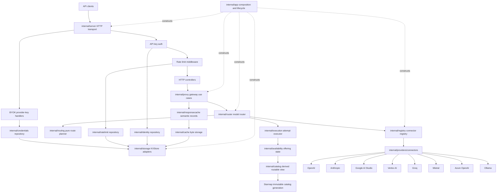

# Starport Architecture

Last updated: 2026-08-03

Starport is a single-binary Go LLM gateway. It exposes OpenAI-compatible and OpenRouter-compatible APIs over one provider-neutral inference core. `cmd/starport` loads configuration and starts the application. `internal/app` owns production composition and lifecycle. The OpenAI and OpenRouter HTTP adapters own their wire formats. `internal/proxy` owns gateway use cases. `internal/router` adapts requests to the pure planner and attempt executor. Starmap owns catalog facts. Concept repositories own durable schemas. `internal/storage` owns KV adapters only.

## Current Status

Implemented:

- HTTP server with chi routing, security controls, health checks, and graceful HTTP shutdown.
- Header-only API-key authentication using SHA-256 hash lookup. Query-string API keys are intentionally rejected.
- Per-API-key rate-limit enforcement using authenticated API key ID and an atomic rate-limit repository.
- Badger and Valkey KV storage backends behind a shared `KVStore` interface.
- Versioned repositories for identities, provider credentials, rate limits, and presets.
- Tenant-safe response caching with canonical chat and embedding records, catalog-generation invalidation, and stream reconstruction.
- Provider connectors for OpenAI, Anthropic, Google AI Studio, Vertex AI, Groq, Mistral, Azure OpenAI, and Ollama.
- Shared provider HTTP-client construction for timeout and connection-pool semantics.
- Separate OpenAI `/v1` and OpenRouter `/api/v1` protocol adapters for chat, embeddings, models, errors, and streaming events.
- Routing uses provider preferences, fallback chains, one attempt budget, and offering-level availability. It supports cost, latency, affinity, and restrictions.
- BYOK provider-key management with encrypted credential storage, provider validation, fallback strategies, usage tracking, and admin/provider-key HTTP endpoints.
- Starmap-backed model, provider, capability, context, and price discovery from one immutable generation.
- Raw HTTP compatibility smoke checks and optional official OpenRouter SDK runners.

Not implemented or still planned:

- Content filtering and moderation pipeline.
- Preset management REST endpoints.
- OpenTelemetry metrics and distributed tracing.
- Full usage analytics, billing, and admin dashboard UI.
- Webhook notifications.
- Enterprise SSO/RBAC and relational audit-log features.

## Runtime Shape



## Package Boundaries

```text
starport/
├── cmd/starport/              # CLI and composition root
├── internal/app/              # application lifecycle and dependency ownership
├── internal/server/           # HTTP server, middleware, routes, controllers, DTO helpers
├── internal/httpapi/openai/   # OpenAI wire DTOs and codecs
├── internal/httpapi/openrouter/ # OpenRouter wire DTOs and codecs
├── internal/proxy/            # chat, streaming, embeddings, model/provider use cases
├── internal/inference/        # canonical chat, embedding, and stream values
├── internal/failure/          # canonical safe failures and provider evidence
├── internal/router/           # use-case adapter for planning and execution
├── internal/routing/          # pure route policy and immutable plans
├── internal/execution/        # attempt state, budgets, fallback, and stream commitment
├── internal/availability/     # offering-level runtime availability state
├── internal/catalog/          # Starmap facts and derived routable generations
├── internal/registry/         # configured connector registry and adapter availability
├── internal/providers/        # BYOK provider keys and concrete LLM connectors
├── internal/httpclient/       # shared provider HTTP transport policy
├── internal/responsecache/    # eligibility, semantic keys, canonical records, stream replay
├── internal/cache/            # local and distributed cache byte storage
├── internal/identity/         # gateway identity model and versioned repository
├── internal/credentials/      # provider credentials, encryption, and repository
├── internal/ratelimit/        # atomic rate-limit policy state and repository
├── internal/presets/          # preset model and versioned repository
├── internal/storage/          # KVStore adapter interface and implementations
├── internal/config/           # environment/.env config loading and validation
├── internal/setup/            # safe first-run configuration and identity creation
└── internal/architecture/     # executable import and package-boundary rules
```

The repository has no public Go package. Starport v1 is a binary-first product. `TestPublicPackageBoundary` rejects a repository `pkg` directory and protocol imports outside approved adapter seams. A public SDK requires a named consumer, version owner, and separate plan.

The protocol packages can repeat wire fields. Each package converts once through `internal/inference` and `internal/failure`. They do not own routing, storage, provider, retry, or cache policy.

## Lifecycle Ownership

`internal/app.New` receives one validated configuration value. It maps that
value to adapter configuration. It then constructs storage, the Starmap
control plane, repositories, providers, cache, routing, and HTTP.

Production needs storage, a catalog, a credential master key, and one explicit
provider. It also needs one named identity in storage. The
`starport init --configured-storage` command creates that identity before the
first process starts. Production composition never selects mock dependencies.
Tests can replace factories through an explicit test-only builder.

`internal/app.App` owns shared dependency lifecycle:

- Storage backend.
- Cache manager.
- Connector registry.
- Hot reload worker.
- HTTP server.

`App.Run` seals provider registration, starts optional catalog refresh and hot
reload work, and starts the HTTP listener. `App.Close` closes owned resources
once in reverse construction order. Constructor rollback uses the same
ownership ledger.

`internal/server.Server` receives ready use-case and repository ports. It owns
only the HTTP listener and route tree. `Server.Shutdown` drains HTTP requests
and does not close the registry, storage, or cache. `internal/registry`
receives explicit connector registrations. It does not read environment
values, select fallback mocks, discover models, or probe provider health.
`Registry.Start` prevents later registrations. `Registry.Close` closes each
registered inference adapter.

## Storage

The `KVStore` interface supports:

- Basic CRUD.
- TTL and `ExpireAt`.
- Atomic increment/decrement and compare-and-swap.
- Batch operations.
- Transactions.
- Prefix scanning.
- health and close lifecycle.

Backends:

- `MockStore` for deterministic unit tests.
- Badger for embedded single-node deployments.
- Valkey/Redis for distributed state, pub/sub invalidation, and multi-node deployments.

The default contract suite tests mock and Badger storage. Set
`TEST_VALKEY_URL` to test Valkey with the same suite.

Concept repositories own these version 1 namespaces:

- `internal/identity`: `identity:v1:`
- `internal/credentials`: `credentials:v1:`
- `internal/ratelimit`: `ratelimit:v1:subject:`
- `internal/presets`: `presets:v1:name:`

Each repository owns its key encoding, record envelope, validation, revisions, and compare-and-swap rules. Controllers and business services use repository contracts. They do not construct durable keys or serialize durable records. The cache package stores response and model-cache data only.

Starport has no released durable-data contract. Therefore, the version 1 repositories do not read old namespaces or run compatibility branches. A future released schema change must use an explicit migration and a new version.

## Response Cache

`internal/responsecache` owns response-cache eligibility, semantic identity, versioned records, and canonical stream reconstruction. `internal/cache` owns only byte storage, TTL, and local/distributed layering. The proxy converts current request and response types at this seam.

Chat and embedding keys use the full SHA-256 digest in the `responsecache:v1:<kind>:` namespace. Identity includes the authenticated API key ID as tenant, the immutable catalog generation, canonical inference input, provider policy, model chains and overrides, and API-key restrictions. Ordered inputs keep their order. Set-like restrictions use sorted copies. Stream delivery options do not change the completed-result identity, so streaming and non-streaming requests can use one canonical record.

The cache fails closed. It skips requests without tenant or catalog identity. It also skips unsupported chat requests. These include provider extensions, image inputs, and invalid tool or output schemas. Starport cannot prove stable result identity for those shapes.

A cache record has its own schema version, semantic key, kind, timestamp, and canonical inference result. A read rejects corrupt, stale-version, wrong-key, and wrong-kind records.

Completed canonical results are the only response-cache value. A streaming miss accumulates canonical events and writes only after clean end-of-stream. A cached streaming request derives fresh delivery events from the completed result and emits usage only when `stream_options.include_usage` requests it.

## Provider Connectors

Connectors implement:

```go
type Connector interface {
    Chat(ctx context.Context, req *ChatRequest) (*ChatResponse, error)
    ChatStream(ctx context.Context, req *ChatRequest) (ChatStream, error)
    Embeddings(ctx context.Context, req *EmbeddingsRequest) (*EmbeddingsResponse, error)
    Name() string
    Close() error
}
```

Provider constructors use one shared HTTP-client construction seam. It maps
operator timeout and connection settings into the provider transport. One
connector call makes one outbound request attempt.

Each inference request carries an exact provider model ID and a bound Starmap
endpoint. A connector does not discover models, select a catalog endpoint, or
probe provider health. Starmap acquisition is the only dynamic catalog-update
path. The attempt executor reports inference results to the Starport runtime
availability tracker.

Starmap uses its catalog-acquisition API keys, cloud credential chains, and
workload identity to build catalog generations. Starport stores separate
gateway and provider inference credentials. Neither credential plane reads or
reuses secret values from the other plane.

## Routing

The router accepts a `router.Request` with:

- Connector chat request.
- Fallback model chain.
- Provider preferences (`order`, `only`, `ignore`, `allow_fallbacks`).
- API-key restrictions (`AllowedProviders`, `AllowedModels`, model overrides).
- routing metadata such as estimated tokens, required features, and sticky affinity key.

`openrouter/auto` lets the planner consider every route in the current routable Starmap snapshot. In a mixed model array, explicit models stay ahead of the automatic fallback set. Cost, latency, capabilities, context limits, availability, and provider affinity order routes within one model rank. Provider policy uses exact adapter IDs such as `google-ai-studio`, `google-vertex`, and `azure-openai`. There are no pre-launch aliases.

Starport supports the `fallback` route mode. Validation rejects other modes
until Starport implements their semantics. A stream can use fallback only
before HTTP receives it. Starport does not use fallback after it can send
bytes.

The pure planner returns one immutable route plan. The executor applies one total attempt limit. It also applies one total elapsed-time limit. Same-route retries and fallback routes consume the same attempt budget. Provider adapters make one request. The HTTP transport has no circuit breaker.

Streaming and non-streaming requests use the same planner and executor. A stream can change routes only before Starport returns the first canonical event. A stream failure after this commitment point is terminal.

Provider errors become canonical failures before execution policy uses them.
The `internal/availability` tracker owns all offering health transitions. It
keys state by provider ID and provider model ID. It admits one half-open probe.

The tracker publishes immutable state to the derived routable view. Vertex AI
uses one configured location for each offering. An explicit planned route
must represent location failover.

## Security

Implemented:

- The identity repository owns the SHA-256 hash index and atomic identity changes.
- A versioned collection record joins every identity create and delete transaction. Initial setup uses it to prove repository emptiness atomically.
- The identity issuer owns gateway-key generation, hashing, and one-time secret return.
- Local initialization writes an owner-only configuration file and creates one named wildcard identity directly.
- Platform-native no-replace rename operations install local state without replacing an existing directory.
- Configured-storage initialization creates the first named identity without a temporary startup credential.
- Failed credential output isolates local state before deletion. Rollback requires the original layout and only the initial identity records.
- Configured storage atomically releases the identity claim after an output failure.
- An initial claim names its identity. Setup can reclaim the claim only when the repository is empty and that identity is absent.
- Startup rejects empty identity storage and does not create an identity.
- Starport accepts API keys from `Authorization` and `X-API-Key` headers only.
- The HTTP edge derives client IP from the direct TCP peer. It ignores untrusted forwarding headers.
- Authentication stores the API key model in request context for ownership and routing checks.
- The credential repository encrypts provider keys with AES-256-GCM. `STARPORT_SECURITY_MASTER_KEY` supplies the production secret.
- The encryption service uses Argon2id when it derives a key from a password value.
- Rate limiting uses the authenticated API key ID, not the raw secret.
- The BYOK repository isolates provider keys by API-key scope.

Still planned:

- Moderation/content filtering.
- OpenTelemetry metrics/traces.
- Enterprise SSO/RBAC and audit logs.

## API Surface

The route group selects the wire dialect before request decoding. Shared gateway behavior returns through the selected codec. OpenRouter middleware and stream errors use the OpenRouter error contract. OpenAI routes use the OpenAI contract.

OpenAI-compatible:

```text
POST /v1/chat/completions
POST /v1/embeddings
GET  /v1/models
GET  /v1/models/{model}
```

OpenRouter-compatible:

```text
POST /api/v1/chat/completions
POST /api/v1/embeddings
GET  /api/v1/models
GET  /api/v1/models/{model}
GET  /api/v1/models/{model}/endpoints
GET  /api/v1/providers
```

Provider-key and admin surfaces:

```text
GET    /api/v1/keys/{key_id}/provider-keys
POST   /api/v1/keys/{key_id}/provider-keys
GET    /api/v1/keys/{key_id}/provider-keys/{provider}
PUT    /api/v1/keys/{key_id}/provider-keys/{provider}
DELETE /api/v1/keys/{key_id}/provider-keys/{provider}
POST   /api/v1/keys/{key_id}/provider-keys/{provider}/validate
GET    /api/v1/keys/{key_id}/usage/provider-keys
GET    /api/v1/keys/{key_id}/usage/comparison
GET    /api/v1/admin/keys/
POST   /api/v1/admin/keys/
GET    /api/v1/admin/keys/{key_id}
PUT    /api/v1/admin/keys/{key_id}
DELETE /api/v1/admin/keys/{key_id}
GET    /api/v1/admin/info
GET    /api/v1/admin/metrics
```

Health and optional UI:

```text
GET /health/live
GET /health/ready
GET /chat/*   # when ChatUI is enabled
```

## Release Verification

The repository owns deterministic architecture, protocol, and distribution
checks. Run the complete local release gate from a clean tag worktree:

```bash
cd /path/to/starmap
make verify

cd /path/to/starport
bash scripts/verify-starmap-ownership.sh
bash scripts/verify-v1-architecture.sh
bash scripts/verify-v1-release.sh
go test ./...
go test -race ./internal/catalog ./internal/proxy ./internal/routing \
  ./internal/providers/connectors ./internal/app ./internal/server
go vet ./...
make lint
make build
bash scripts/smoke-openrouter-sdks.sh
make release-check
make release-snapshot
```

The release gate requires raw HTTP and the official OpenRouter Python,
TypeScript, and Go SDKs. It also verifies six static binaries, six archives,
six SBOMs, action provenance, checksums, build provenance, the non-root
multi-platform container, and immutable release readback.

Starport releases must use a published Starmap version with no local module
replacement.
