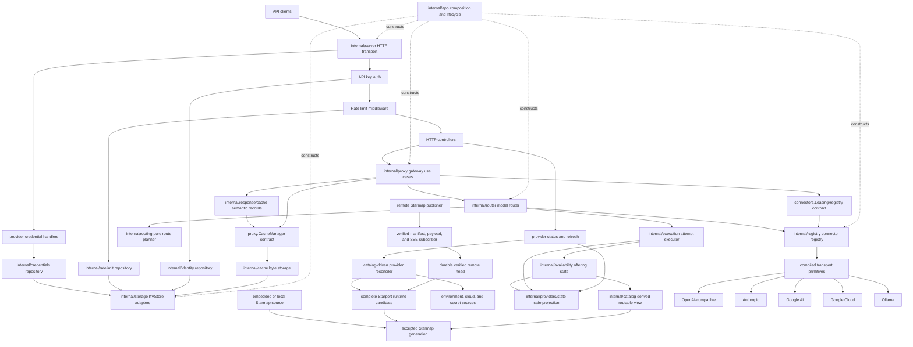

# Starport Architecture

Last updated: 2026-08-19

Starport is a single-binary Go LLM gateway. It exposes OpenAI-compatible and OpenRouter-compatible APIs over one provider-neutral inference core. `cmd/starport` loads configuration and starts the application. `internal/app` owns production composition and lifecycle. The OpenAI and OpenRouter HTTP adapters own their wire formats. `internal/proxy` owns gateway use cases. `internal/router` adapts requests to the pure planner and attempt executor. Starmap owns catalog facts. Concept repositories own durable schemas. `internal/storage` owns KV adapters only.

## Current Status

Implemented:

- HTTP server with chi routing, security controls, health checks, and graceful HTTP shutdown.
- Header-only API-key authentication using SHA-256 hash lookup. Query-string API keys are intentionally rejected.
- Per-API-key rate-limit enforcement using authenticated API key ID and an atomic rate-limit repository.
- Badger and Valkey KV storage backends behind a shared `KVStore` interface.
- Versioned repositories for identities, provider credentials, rate limits, and presets.
- Tenant-safe response caching with canonical chat and embedding records, catalog-generation invalidation, and stream reconstruction.
- Catalog-driven provider activation over the compiled OpenAI-compatible,
  Anthropic, Google AI, Google Cloud, and Ollama transport primitives.
- Catalog-driven inference credential discovery, interval reconciliation, and
  authenticated manual refresh without a local provider roster.
- Secret-free provider state that separates adapter support, operator
  credentials, and offering availability.
- Connector-owned HTTP-client construction for first-response-byte and connection-pool semantics.
- Separate OpenAI `/v1` and OpenRouter `/api/v1` protocol adapters for chat, embeddings, models, errors, and streaming events.
- Routing uses provider preferences, fallback chains, one attempt budget, and offering-level availability. It supports cost, latency, affinity, and restrictions.
- Provider inference credentials in three sources: the process environment, a
  gateway credential the operator applies for the whole deployment, and the BYOK
  a tenant brings for itself. Encrypted storage, provider validation, per-tenant
  selection strategies, per-source usage attribution, and separate operator and
  tenant HTTP endpoints.
- Tenant accounts that own gateway API keys, account-wide limits, and the
  default credential strategy. A gateway API key authenticates a request; the
  tenant behind it bounds what that request may spend.
- A gateway authentication mode the operator sets by flag, configuration, or
  console switch, with a local admin token for first-run console access.
- Starmap-backed model, provider, capability, context, and price discovery from one immutable generation.
- Raw HTTP compatibility smoke checks and optional official OpenRouter SDK runners.
- Usage accounting in `internal/usage`: the proxy writes one request record
  per completion under the versioned `usage:v1:` namespace, and
  `/api/v1/activity` serves per-key and admin-wide request logs.
- Catalog freshness surface: snapshot generation metadata over HTTP and an
  authenticated catalog refresh path.
- Preset management REST endpoints with `@preset/` request resolution.
- OpenRouter routing-preference completion: `provider.sort` and `max_price`
  reach the routing policy.
- Per-key spend and token budgets with 402 exhaustion responses,
  `X-Starport-Budget-*` headers, and per-key `allowed_models` restrictions.
- Embedded web console (`internal/console`) for chat, model comparison,
  presets, models, providers, keys, usage, and settings against the local
  gateway.

Not implemented or still planned:

- Content filtering and moderation pipeline.
- OpenTelemetry metrics and distributed tracing.
- Billing integration.
- Webhook notifications.
- Enterprise SSO/RBAC and relational audit-log features.

## Runtime Shape



## Package Boundaries

```text
starport/
├── cmd/starport/              # CLI and composition root
├── internal/app/              # application lifecycle and dependency ownership
├── internal/server/           # HTTP server, middleware, routes, controllers, DTO helpers
├── internal/protocol/openai/  # OpenAI wire DTOs and codecs
├── internal/protocol/openrouter/ # OpenRouter wire DTOs and codecs
├── internal/proxy/            # gateway use cases and cache behavior contract
├── internal/inference/        # canonical chat, embedding, and stream values
├── internal/failure/          # canonical safe failures and provider evidence
├── internal/router/           # use-case adapter for planning and execution
├── internal/routing/          # pure route policy and immutable plans
├── internal/execution/        # attempt state, budgets, fallback, and stream commitment
├── internal/availability/     # offering-level runtime availability state
├── internal/providers/state/  # safe adapter, credential, and offering state
├── internal/catalog/          # Starmap acquisition policy and derived routable generations
├── internal/registry/         # catalog-derived connector generations and adapter availability
├── internal/providers/        # provider runtime composition and credential reconciliation
├── internal/providers/connectors/ # runtime leases, wire adapters, and provider HTTP policy
├── internal/providers/auth/   # request credential placement by catalog primitive
├── internal/providers/keyring/ # provider credential sources, scopes, and selection strategies
├── internal/credentials/cloudchain/ # renewable cloud credential acquisition
├── internal/response/cache/   # eligibility, semantic keys, canonical records, stream replay
├── internal/cache/            # local and distributed cache byte storage
├── internal/identity/         # gateway identity model and versioned repository
├── internal/tenant/           # account identity, account-wide limits, credential strategy
├── internal/limits/           # request-rate and consumption vocabulary shared by key and tenant
├── internal/authmode/         # whether the gateway requires a gateway API key
├── internal/localauth/        # local admin token, launch tickets, and console sessions
├── internal/credentials/      # provider credentials, encryption, and repository
├── internal/ratelimit/        # atomic rate-limit policy state and repository
├── internal/presets/          # preset model and versioned repository
├── internal/usage/            # request records, usage aggregation, and repository
├── internal/console/          # embedded web console (single-page app build and handler)
├── internal/storage/          # KVStore adapter interface and implementations
├── internal/config/           # environment/.env config loading and validation
├── internal/setup/            # safe first-run configuration and identity creation
├── internal/diagnosis/        # read-only startup checks and exact check results
└── internal/architecture/     # executable import and package-boundary rules
```

The repository has no public Go package. Starport v1 is a binary-first product. `TestPublicPackageBoundary` rejects a repository `pkg` directory and protocol imports outside approved adapter seams. A public SDK requires a named consumer, version owner, and separate plan.

The protocol packages can repeat wire fields. Each package converts once through `internal/inference` and `internal/failure`. They do not own routing, storage, provider, retry, or cache policy.

## Dependency Direction

Stable use-case packages depend on behavior contracts. The composition root
selects concrete adapters.

- `internal/proxy` accepts `CacheManager` and
  `connectors.LeasingRegistry`. It does not import `internal/cache` or
  `internal/registry`.
- `internal/app` coordinates catalog refresh and complete runtime activation.
  It does not select Starmap sources or expose Starmap sync options.
- `internal/catalog` owns local acquisition source selection, sync options,
  timeout policy, and the verified remote candidate contract.
- A retained provider runtime lease supplies the matching Starmap snapshot,
  connector generation, credential source, and authentication-required fact.

`scripts/verify-dependency-direction.sh` enforces conditions `SP-D01` through
`SP-D06` across production and test imports. Its mutation suite proves that
each condition fails independently. The standard v1 architecture gate runs
both scripts.

## Lifecycle Ownership

`internal/app.New` receives one validated configuration value. It maps that
value to adapter configuration. It then constructs storage, the Starmap
control plane, repositories, providers, cache, routing, and HTTP.

`internal/diagnosis` checks the same configuration, Starmap catalog, adapter
registry, storage, and identity contracts without server construction. Its
default checks are passive. An explicit probe opens storage through a
write-blocking adapter. The diagnostic report uses stable check IDs and never
contains a configured secret.

Production needs storage, a catalog, and a credential master key. Operator
provider credentials are optional. Production also needs one named identity in storage. The
`starport init --configured-storage` command creates that identity before the
first process starts. Production composition never selects mock dependencies.
Tests can replace factories through an explicit test-only builder.

`internal/app.App` owns shared dependency lifecycle:

- Storage backend.
- Cache manager.
- Connector registry.
- Local acquisition or verified remote-catalog worker.
- HTTP server.

`App.Run` starts provider reconciliation, optional catalog refresh, hot reload
work, and the HTTP listener. `App.Close` closes owned resources once in reverse
construction order. Constructor rollback uses the same ownership ledger.

Concept ownership does not depend on process topology. In local mode,
`internal/catalog` composes the Starmap acquisition package and owns source and
sync option selection. The app requests one complete refresh candidate for
single-binary startup and scheduled refresh. Starmap still owns acquisition
protocols, credentials, mapping, reconciliation, and publication. In remote
mode, a separately operated Starmap publisher provides operational isolation.
Both modes publish the same immutable catalog-generation contract into the same
atomic Starport activation transaction.

`internal/server.Server` receives ready use-case and repository ports. It owns
only the HTTP listener and route tree. `Server.Shutdown` drains HTTP requests
and does not close the registry, storage, or cache.

`internal/registry` receives complete catalog-derived connector generations.
It does not read environment values, select fallback mocks, discover models, or
probe provider health. A registration can contain an optional deployment-owned
material source. Adapter availability does not contain credential availability.
`Registry.Start` closes its construction-only registration API. The runtime can
still publish a complete prepared generation through its atomic publication
seam. Replaced generations drain their connectors after active users release
them. `Registry.Close` closes the current inference adapters.

The registry returns runtime leases through the connector-owned contract. The
gateway derives model and provider discovery from the lease's retained Starmap
snapshot. It does not ask the registry for a second catalog projection.

Remote catalog activation uses two durable current pointers over one set of
immutable generation records. The Starmap subscriber advances the verified
remote head only after protocol and payload verification. Starport advances
the accepted head only after it constructs and validates the complete catalog,
connector registry, credential projection, routing view, and cache identity.
The process publishes that candidate atomically. A rejected candidate leaves
the accepted head and live runtime unchanged.

The subscriber owns remote fetch, SSE, reconnect, catch-up, and liveness. A
small Starport sampler observes only the subscriber's process-local atomic
state. Its interval causes no network request. Neither catalog acquisition nor
remote secret-store I/O is part of the inference hot path.

## Storage

The `KVStore` interface supports:

- Basic CRUD.
- TTL and `ExpireAt`.
- Atomic increment/decrement and compare-and-swap.
- Batch operations.
- Transactions.
- Prefix scanning.
- health and close lifecycle.

Backends:

- `MockStore` for deterministic unit tests.
- Badger for embedded single-node deployments.
- Valkey/Redis for distributed state, pub/sub invalidation, and multi-node deployments.

The default contract suite tests mock and Badger storage. Set
`TEST_VALKEY_URL` to test Valkey with the same suite.

Concept repositories own these version 1 namespaces:

- `internal/identity`: `identity:v1:`
- `internal/credentials`: `credentials:v1:`
- `internal/ratelimit`: `ratelimit:v1:subject:`
- `internal/presets`: `presets:v1:name:`
- `internal/usage`: `usage:v1:`
- `internal/catalog`: `catalog_generation:v1:` for accepted state and
  `catalog_remote_generation:v1:` for the independently verified remote head
- `internal/files`: `files:v1:tenant:`

Each repository owns its key encoding, record envelope, validation, revisions, and compare-and-swap rules. Controllers and business services use repository contracts. They do not construct durable keys or serialize durable records. The cache package stores response and model-cache data only.

Starport has no released durable-data contract. Therefore, the version 1 repositories do not read old namespaces or run compatibility branches. A future released schema change must use an explicit migration and a new version.

### File Storage

A stored file has two halves, and they live apart. The record holds the
identifier, the filename, the purpose, the size, the owning account, and the
expiry, and it goes to the `KVStore` under `files:v1:tenant:`. The bytes go to
`internal/blob`, which owns them alone.

The split follows the size. A record is small, indexed, and scanned by prefix.
A byte range is large, written once, and read whole. A `KVStore` value that
held a 512 MiB upload would put that payload in every prefix scan.

`blob.Store` exposes `Put`, `Get`, `Stat`, `Delete`, and `Backend`. Two
implementations satisfy it:

- `filesystem` writes under a deployment path. It is the default and needs no
  external service.
- `objectstore` writes to an S3-compatible bucket, which reaches AWS S3,
  Cloudflare R2, MinIO, and Backblaze B2.

An incomplete object-store selection refuses startup. It does not fall back to
the filesystem. A deployment that asked for a shared bucket and got a local
directory would lose a file the moment a second node answered.

`internal/files` owns the record, the purpose set, the retention window, and
the stored-byte bound. It reaches the bytes only through `blob.Store`. No other
package names a backend, a bucket, or a path.

## Response Cache

`internal/response/cache` owns response-cache eligibility, semantic identity, versioned records, and canonical stream reconstruction. `internal/cache` owns only byte storage, TTL, and local/distributed layering. The proxy converts current request and response types at this seam.

Chat and embedding keys use the full SHA-256 digest in the `responsecache:v1:<kind>:` namespace. Identity includes the authenticated API key ID as tenant, the immutable catalog generation, canonical inference input, provider policy, model chains and overrides, and API-key restrictions. Ordered inputs keep their order. Set-like restrictions use sorted copies. Stream delivery options do not change the completed-result identity, so streaming and non-streaming requests can use one canonical record.

The cache fails closed. It skips requests without tenant or catalog identity. It also skips unsupported chat requests. These include provider extensions, image inputs, and invalid tool or output schemas. Starport cannot prove stable result identity for those shapes.

A cache record has its own schema version, semantic key, kind, timestamp, and canonical inference result. A read rejects corrupt, stale-version, wrong-key, and wrong-kind records.

Completed canonical results are the only response-cache value. A streaming miss accumulates canonical events and writes only after clean end-of-stream. A cached streaming request derives fresh delivery events from the completed result and emits usage only when `stream_options.include_usage` requests it.

## Provider Connectors

Connectors implement:

```go
type Connector interface {
    Chat(ctx context.Context, req *ChatRequest) (*ChatResponse, error)
    ChatStream(ctx context.Context, req *ChatRequest) (ChatStream, error)
    Embeddings(ctx context.Context, req *EmbeddingsRequest) (*EmbeddingsResponse, error)
    Name() string
    Close() error
}
```

Provider constructors use one shared HTTP-client construction seam. It maps
operator timeout and connection settings into the provider transport. One
connector call makes one outbound request attempt.

The routable snapshot retains Starmap endpoint templates. Request policy first
selects tenant or deployment-owned inference material. The retained runtime
generation then binds that material to the selected template. Deployment-owned
base URL overrides apply only to deployment-owned material.

Each connector receives the exact provider model ID and the request-bound endpoint. A
connector does not discover models, select a catalog endpoint, or probe
provider health. Starmap acquisition is the only dynamic catalog-update path.
The attempt executor reports inference results to the Starport runtime
availability tracker.

Starmap uses its catalog-acquisition API keys, cloud credential chains, and
workload identity to build catalog generations. Starport stores separate
gateway and provider inference credentials. Neither credential plane reads or
reuses secret values from the other plane. Remote catalog authentication proves
access to a publisher. It is a third, separate protocol credential and never
becomes provider material.

`internal/credentials/cloudchain` owns renewable inference bearer tokens.
`internal/providers/auth` applies resolved material through catalog-declared
request placements. Vertex AI uses Google Application Default Credentials with
the Google Cloud platform scope. The Google source preserves the Application
Default Credentials quota project. Request authentication sends it as
`X-Goog-User-Project` without replacing an explicit request header. The
transport rejects HTTP redirects before it reuses a renewable credential.

Azure OpenAI uses `DefaultAzureCredential` with the Azure Cognitive Services
scope. A synchronized source caches each token and refreshes it two minutes
before expiry. Waiting requests can stop through their own contexts. The HTTP
transport gets credentials with the inference request context.

Starmap declares the ordered inference authentication profiles for each
provider. Starport attempts only the compiled profiles in that order. A
catalog-declared default cloud profile can discover ambient workload identity
or local developer credentials without a provider-specific Starport setting.
A static profile uses only its declared fields. Starport does not combine
static and default-cloud material into one profile.

`internal/providers` owns one reconciler for all catalog providers. It resolves
credentials during startup and through shared scheduled or manual work. It
publishes a complete runtime generation only after connector and catalog
validation. One provider-local failure does not block other providers. Process
environment changes require a restart because another process cannot mutate a
running process environment. Renewable cloud and direct secret sources can
change material through their lifecycle without a restart.

`internal/providers/state` projects adapter support, operator credential state,
and exact offering availability as separate values. It stores an opaque
material version only for stale-result rejection and never returns that value
through HTTP. Tenant BYOK outcomes cannot change shared operator state.

`internal/credentials` also owns direct inference secret-source adapters.
It supports Google Cloud Secret Manager, Azure Key Vault, AWS Secrets Manager,
HashiCorp Vault KV v2, and OpenBao KV v2. Catalog-derived
`STARPORT_<PROVIDER>_<FIELD>_REFERENCE` names select these adapters. The
reference contains resource identity, an optional version, and an optional
field. Secret-store authentication stays in each platform's default identity
chain or client environment.

All direct adapters use the same resolver cache, single-flight work, refresh,
revocation, and failure types. They do not add a second cache. A direct source
without its own expiry gets the configured remote refresh interval. Cache hits
make no secret-store request. Each selected read owns and closes its client or
idle HTTP resources.

## Credentials and Tenants

Starport holds two unrelated kinds of secret. A gateway API key authenticates a
caller to Starport. A provider credential pays a provider. They never convert
into each other, and no HTTP path returns one when asked for the other.

`internal/providers/keyring` owns the provider credential vocabulary. Three
sources can pay for one request, and two of the three belong to the operator:

| Source | Owner | Where it lives | Applied by |
| --- | --- | --- | --- |
| `environment` | operator | the gateway process environment | a restart |
| `gateway` | operator | encrypted storage at scope `*` | the console or the admin API |
| `byok` | tenant | encrypted storage at scope `tenant:<id>` | the tenant |

Only the third is BYOK. The word names a credential a tenant brought for
itself, and nothing else. A credential the operator applies for the whole
deployment is a gateway credential even though it is stored the same way,
because the difference that matters is who owns the spend.

A per-tenant strategy chooses the order. `operator_first` offers the
environment credential, then the gateway credential, then the tenant's own.
`byok_first` moves the tenant's own credential to the front and keeps the two
operator sources adjacent behind it, because they are the same operator's
money. `byok_only` narrows the request to the tenant's own credential and fails
when it is absent.

A gateway API key may name a strategy in its metadata. It can only narrow the
account's: a key held by a `byok_only` tenant cannot ask for operator
credentials, and a request that would widen the account's strategy is refused
rather than quietly downgraded. A key that names none inherits the account's.

Selection happens per attempt, not per request, so a refused credential falls
through to the next source in the same request. The attempt that answered
carries the source it spent into `usage.Record.credential_source`, which is how
an operator reads which plane paid rather than only which provider served.

`internal/tenant` owns the account behind a gateway API key: the account-wide
limits, the default credential strategy, and the account's own BYOK scope.
`internal/limits` owns the limit vocabulary itself, because both a key and a
tenant hold limits and neither owns the other's. A request satisfies both
meters. A key limit bounds one key; it never raises or lowers what the account
may spend in total.

Tenant outcomes stay tenant-local. A provider that refuses a tenant's BYOK marks
nothing in the shared operator availability state, because one account's expired
credential is not evidence about the deployment's.

## Routing

The router accepts a `router.Request` with:

- Connector chat request.
- Fallback model chain.
- Provider preferences (`order`, `only`, `ignore`, `allow_fallbacks`).
- API-key restrictions (`AllowedProviders`, `AllowedModels`, model overrides).
- routing metadata such as estimated tokens, required features, and sticky affinity key.

`openrouter/auto` lets the planner consider every route in the current routable Starmap snapshot. In a mixed model array, explicit models stay ahead of the automatic fallback set. Cost, latency, capabilities, context limits, availability, and provider affinity order routes within one model rank. Provider policy uses exact adapter IDs such as `google-ai-studio`, `google-vertex`, and `azure-openai`. There are no pre-launch aliases.

Starport supports the `fallback` route mode. Validation rejects other modes
until Starport implements their semantics. A stream can use fallback only
before HTTP receives it. Starport does not use fallback after it can send
bytes.

The pure planner returns one immutable route plan. The executor applies one
total attempt limit and one total elapsed-time limit. Same-route retries and
fallback routes consume the same attempt budget. Provider adapters make one
request. Their private HTTP builder owns connection pools, dialing, handshakes,
redirects, and the first-response-byte timeout. It does not add a total client
timeout, mutate provider responses, retry, or implement a circuit breaker.

Streaming and non-streaming requests use the same planner and executor. A stream can change routes only before Starport returns the first canonical event. A stream failure after this commitment point is terminal.

Provider errors become canonical failures before execution policy uses them.
The `internal/availability` tracker owns all offering health transitions. It
keys state by provider ID and provider model ID. It admits one half-open probe.

The tracker publishes immutable state to the derived routable view. Vertex AI
uses one configured location for each offering. An explicit planned route
must represent location failover.

## Security

Implemented:

- The identity repository owns the SHA-256 hash index and atomic identity changes.
- A versioned collection record joins every identity create and delete transaction. Initial setup uses it to prove repository emptiness atomically.
- Independent identity creation retries collection-record contention without weakening duplicate-key conflicts.
- The identity issuer owns gateway-key generation, hashing, and one-time secret return.
- Local initialization writes an owner-only configuration file and creates one named wildcard identity directly.
- Platform-native no-replace rename operations install local state without replacing an existing directory.
- Directory synchronization makes staged contents and the installed rename durable before the command reports success.
- Configured-storage initialization creates the first named identity without a temporary startup credential.
- Failed credential output isolates local state before deletion. Rollback requires the original layout and only the initial identity records.
- Configured storage atomically releases the identity claim after an output failure.
- An initial claim names its identity. Setup can reclaim the claim only when the repository is empty and that identity is absent.
- Startup rejects empty identity storage and does not create an identity.
- Starport accepts API keys from `Authorization` and `X-API-Key` headers only.
- The HTTP edge derives client IP from the direct TCP peer. It ignores untrusted forwarding headers.
- Authentication stores the API key model in request context for ownership and routing checks.
- The credential repository encrypts provider keys with AES-256-GCM. `STARPORT_SECURITY_MASTER_KEY` supplies the production secret.
- The encryption service uses Argon2id when it derives a key from a password value.
- Rate limiting uses the authenticated API key ID, not the raw secret.
- The credential repository isolates stored provider credentials by scope. The
  operator's gateway credential is stored at `*`; a tenant's BYOK is stored at
  `tenant:<id>` and no other tenant can read or spend it.
- Disabling the gateway authentication mode requires a local listener. A
  deployment bound to a routable address refuses the disabled mode unless the
  operator states the exposure explicitly.
- The local admin token is a file readable only by the account running the
  gateway. It is not a gateway API key, holds no tenant, and never authenticates
  an inference request.

Still planned:

- Moderation/content filtering.
- OpenTelemetry metrics/traces.
- Enterprise SSO/RBAC and audit logs.

## API Surface

The route group selects the wire dialect before request decoding. Shared gateway behavior returns through the selected codec. OpenRouter middleware and stream errors use the OpenRouter error contract. OpenAI routes use the OpenAI contract.

OpenAI-compatible:

```text
POST   /v1/chat/completions
POST   /v1/embeddings
POST   /v1/images/generations
POST   /v1/images/edits
POST   /v1/audio/speech
POST   /v1/audio/transcriptions
POST   /v1/audio/translations
POST   /v1/files
GET    /v1/files
GET    /v1/files/{file_id}
DELETE /v1/files/{file_id}
GET    /v1/files/{file_id}/content
GET    /v1/models
GET    /v1/models/{model}
```

OpenRouter-compatible:

```text
POST /api/v1/chat/completions
POST /api/v1/embeddings
POST /api/v1/images
POST /api/v1/audio/speech
POST /api/v1/audio/transcriptions
GET  /api/v1/models
GET  /api/v1/models/{model}
GET  /api/v1/models/{model}/endpoints
GET  /api/v1/providers
```

OpenRouter publishes no image edit path and no translation path. Its media list
is shorter rather than padded with paths its own clients cannot call. It also
publishes no file store, so the five file paths stay on the OpenAI group alone.

A read route needs `files:read`. A write route needs `files:write`. The scopes
stay separate because a caller that names a stored document in a chat request
reads it and never stores one.

### Modalities and operations

A modality names one payload family. It answers what a request carries and what
a model accepts, so a route decision compares like with like.

| Modality | Meaning |
| --- | --- |
| `text` | written or spoken language as characters |
| `image` | a still picture |
| `audio` | recorded sound |
| `document` | a paged document, such as a PDF |
| `video` | moving pictures |

Starmap records a document as the `pdf` modality. `internal/catalog` owns that
translation, and no other package restates it.

An operation names one provider inference call. The values match the Starmap
spelling exactly, because the catalog is the only source that names an
operation. `internal/routing` holds the set this build can plan.

| Operation | Meaning |
| --- | --- |
| `chat-completions` | generates chat completions |
| `embeddings` | generates vector embeddings |
| `images-generations` | generates an image from a prompt |
| `images-edits` | generates an image from a prompt and a source image |
| `audio-speech` | generates speech from text |
| `audio-transcriptions` | writes recorded speech as text in its own language |
| `audio-translations` | writes recorded speech as English text |

A catalog fact that names an operation outside the set describes a gateway that
has not shipped yet. The planner treats such a fact as inert rather than as
corruption.

Provider credentials. The operator applies one credential for the whole
deployment; a tenant brings its own. The two never share a path, because they
differ in who owns the credential:

```text
GET    /api/v1/providers/{provider}/credentials
PUT    /api/v1/providers/{provider}/credentials
DELETE /api/v1/providers/{provider}/credentials
POST   /api/v1/providers/{provider}/credentials/validate
GET    /api/v1/tenants/{tenant_id}/byok
GET    /api/v1/tenants/{tenant_id}/byok/{provider}
PUT    /api/v1/tenants/{tenant_id}/byok/{provider}
DELETE /api/v1/tenants/{tenant_id}/byok/{provider}
POST   /api/v1/tenants/{tenant_id}/byok/{provider}/validate
```

Account usage and admin surfaces:

```text
GET    /api/v1/tenants/{tenant_id}/usage/providers
GET    /api/v1/admin/keys/
POST   /api/v1/admin/keys/
GET    /api/v1/admin/keys/{key_id}
PUT    /api/v1/admin/keys/{key_id}
DELETE /api/v1/admin/keys/{key_id}
GET    /api/v1/admin/tenants
POST   /api/v1/admin/tenants
GET    /api/v1/admin/tenants/{tenant_id}
PUT    /api/v1/admin/tenants/{tenant_id}
DELETE /api/v1/admin/tenants/{tenant_id}
GET    /api/v1/admin/info
GET    /api/v1/admin/metrics
GET    /api/v1/admin/providers
POST   /api/v1/admin/providers/refresh
```

Health and the optional web console:

```text
GET /health/live
GET /health/ready
GET /            # console pages, when the console is enabled:
GET /chat        #   /, /chat, /presets, /models, /providers, /authors,
                 #   /keys, /usage, /settings, and their detail routes
GET /assets/*    # embedded hashed console build assets
```

## Release Verification

The repository owns deterministic architecture, protocol, and distribution
checks. Run the complete local release gate from a clean tag worktree:

```bash
cd /path/to/starmap
make verify

cd /path/to/starport
bash scripts/verify-starmap-ownership.sh
bash scripts/verify-v1-architecture.sh
bash scripts/verify-v1-release.sh
go test ./...
go test -race ./internal/catalog ./internal/proxy ./internal/routing \
  ./internal/providers/connectors ./internal/app ./internal/server
go vet ./...
make lint
make build
bash scripts/smoke-openrouter-sdks.sh
make release-check
make release-snapshot
```

The release gate requires raw HTTP and the official OpenRouter Python,
TypeScript, and Go SDKs. It also verifies six static binaries, six archives,
six SBOMs, action provenance, checksums, build provenance, the non-root
multi-platform container, and immutable release readback.

Starport releases must use a published Starmap version with no local module
replacement.
