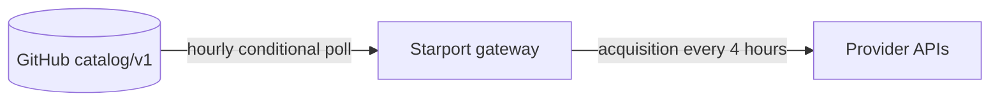
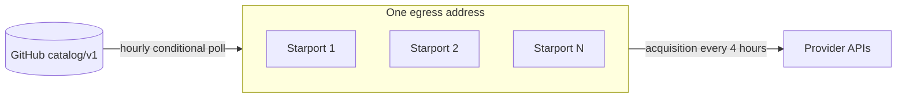
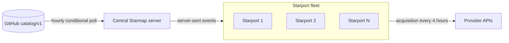
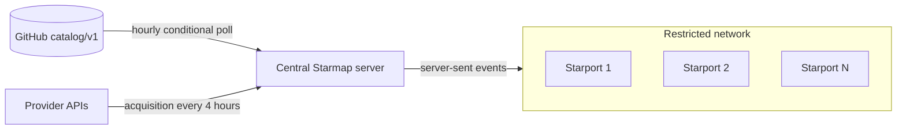
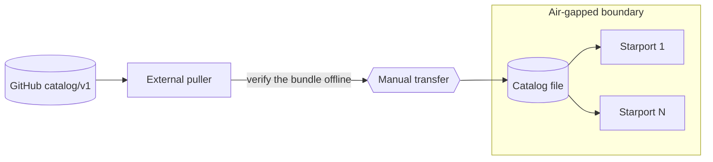
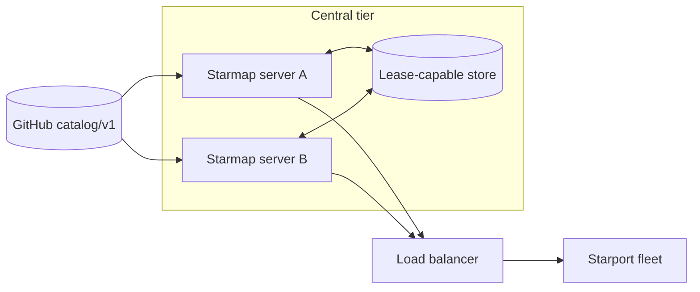

# Starport deployment topologies

Starport reads one connected Starmap runtime. A deployment names one catalog
source kind, and that kind decides the egress, the freshness age, and the
request budget. This guide names five topologies and one replicated variant.

Every setting name below carries the `STARPORT_CATALOG_` prefix. The
[operator guide](OPERATOR-GUIDE.md#catalog-configuration) gives each name, its
default, its valid values, and its interactions. The
[configuration reference](../.env.example) lists every name with its default.

Starmap publishes to the `catalog/v1` channel every four hours at minute
17. A gateway asks its source for a newer publication every hour. The
end-to-end freshness objective is six hours. A polling hop adds one poll
interval to that age. A push hop adds no interval.

## Decision table

| Topology | Replica egress | `SOURCE` | `ACQUISITION_ENABLED` | Freshness age |
| --- | --- | --- | --- | --- |
| Single Starport with direct GitHub | GitHub and providers | `public` | `true` | 6 hours |
| Starport fleet with direct GitHub | GitHub and providers | `public` | `true` | 6 hours |
| Central Starmap server with replica acquisition | central server and providers | `starmap` | `true` | 6 hours |
| Restricted replica egress | central server alone | `starmap` | `false` | 6 hours |
| Air-gapped mirror | none | `file` | `false` | transfer cadence |

Read the table from the top and take the first row that matches the
deployment. Four questions select the row:

1. How many gateway instances leave one egress address?
2. Do the replicas reach GitHub?
3. Do the replicas reach the provider APIs?
4. Does any host inside the boundary reach the internet?

A deployment that answers no to question 4 uses the air-gapped mirror. A
deployment that answers no to question 2 alone uses a central Starmap server.

## Single Starport with direct GitHub

One gateway follows the public publication channel and observes the providers
on its own schedule.

**Settings.** The shipped defaults hold, and this topology needs no catalog
setting. `SOURCE` stays `public`, `ACQUISITION_ENABLED` stays `true`, and
`SOURCE_POLL_INTERVAL` stays `1h`.

**Request budget.** The gateway sends about one conditional source request an
hour. GitHub allows 60 unauthenticated requests an hour for each egress
address, and a `304` answer counts against that ceiling. One gateway therefore
uses about two percent of the unauthenticated budget.

**Freshness age.** Starmap publishes every four hours. The gateway polls every
hour, so the age objective is six hours. The runtime grades the served
catalog `warn` above `SOURCE_MAX_AGE` and `critical` above five thirds of it.
The default of six hours gives `warn` above six hours and `critical` above
ten hours.

**Egress.** The gateway reaches GitHub for the catalog and reaches each
provider API for acquisition.

**Failure behavior.** A source that does not answer leaves the accepted head in
place. The default `prefer_source` policy starts the gateway on the embedded
baseline and adopts the source at the first successful read. The
`require_source` policy reads the source once at open. It fails startup when
that read fails.

## Starport fleet with direct GitHub

Two or more gateways follow the same public channel behind one egress address.

**Settings.** Set `SOURCE_TOKEN` to one GitHub token that every replica shares.
The token raises the hourly ceiling from 60 requests for each address to 5,000
requests for each token. Keep `STARTUP_SPREAD` at `15m`, because the spread
holds a cold fleet away from one moment.

**Request budget.** A direct consumer budgets from the GitHub rate-limit
headers. The four headers are `x-ratelimit-limit`, `x-ratelimit-used`,
`x-ratelimit-remaining`, and `x-ratelimit-reset`. The runtime records the
measured requests for each refresh cycle. The fleet capacity is the remaining
budget minus a reserved headroom, divided by the measured requests for each
cycle. The status warns when `used` passes 80 percent of `limit`.

The rate that a fleet puts on GitHub follows the fleet size and the window:

| Fleet | 15-minute startup spread | 1-hour poll interval | 4-hour acquisition |
| --- | --- | --- | --- |
| 100 | 0.111 requests a second | 0.028 requests a second | 0.007 requests a second |
| 10,000 | 11.11 requests a second | 2.78 requests a second | 0.69 requests a second |
| 100,000 | 111.1 requests a second | 27.78 requests a second | 6.94 requests a second |

A published ceiling is not a safe threshold. Move to a central Starmap server
at any of these three points:

- Above 60 replicas behind one egress address with no token. Each replica
  needs one poll an hour, and the hourly ceiling is 60.
- Above about 5,000 replicas that share one token. The token ceiling is 5,000
  requests an hour.
- Above 10,000 replicas. The 15-minute spread then puts 11 requests a second
  against a secondary limit of 15 requests a second. No headroom remains.

**Freshness age.** The objective stays six hours, because every replica reads
the channel directly.

**Egress.** Every replica reaches GitHub and every replica reaches the provider
APIs.

**Failure behavior.** A rate-limit refusal leaves the accepted head in place
and the next phase retries. Each replica keeps its own accepted head, so one
refused replica does not move another replica.

## Central Starmap server with replica acquisition

One Starmap server follows GitHub and serves the fleet. Each replica reads the
server and keeps its own provider acquisition.

**Settings.** Set `SOURCE=starmap` and set `SOURCE_URL` to the versioned base
URL of the server. Set `SOURCE_API_KEY` when the server needs one. Keep
`ACQUISITION_ENABLED=true`, and keep `SOURCE_MAX_HOPS` at `8`.
`SOURCE_API_KEY` is a catalog-acquisition credential. It never pays a provider.

**Request budget.** One host reaches GitHub, so the fleet size no longer counts
against the GitHub budget. The central server holds one subscription for each
replica. Size the server on the connection count and on the burst after a new
publication. A fleet of 100,000 replicas draws about 350 Mbps from the server
inside the 15-minute spread window.

**Freshness age.** The server pushes each publication over server-sent events,
so a push hop adds no poll interval. The objective stays six hours. A hop that
falls back to polling adds one poll interval to the age.

**Egress.** The central server reaches GitHub. Each replica reaches the central
server and reaches the provider APIs.

**Failure behavior.** A stream that fails three times in a row falls back to a
poll of the upstream manifest. A server outage leaves each replica on its
accepted head, and the runtime status reports the fallback state. A `401` or a
`403` stops the subscription until the credential changes.

## Restricted replica egress

The central server keeps the egress to GitHub and to the providers. Each
replica reaches the central server alone.

**Settings.** Set `SOURCE=starmap` and `SOURCE_URL` as above, and set
`ACQUISITION_ENABLED=false` on every replica. A false value stops every
automatic observation, so the replica opens no provider connection for the
catalog.

**Request budget.** The replicas send no GitHub request and no provider
observation. The central server owns the complete external budget.

**Freshness age.** The objective stays six hours, because the server-sent
events reach the replicas without a poll.

**Egress.** Each replica reaches one address, which is the central server.

**Failure behavior.** A replica that loses the server keeps its accepted head
and reconnects with a bounded retry. The replica observes no provider, so a
provider outage does not change its catalog facts.

This topology is not air-gapped. The central server still reaches GitHub and
still reaches the provider APIs, so a route out of the network exists. An
attacker who reaches the central server reaches the internet through it. A
deployment that permits no such route uses the air-gapped mirror below.

## Air-gapped mirror

No host inside the boundary reaches GitHub or a provider. An external process
outside the boundary reads the artifact and its verification bundle. An
operator moves both files across the boundary on a schedule.

**Settings.** Set `SOURCE=file` and set `SOURCE_URL` to the path of the
transferred catalog file. Set `ACQUISITION_ENABLED=false` on every host. Leave
`SOURCE_MAX_AGE` at the transfer cadence, so the grade follows the schedule
that the operator controls.

**Request budget.** No host inside the boundary sends a catalog request. The
external puller alone counts against the GitHub budget.

**Freshness age.** The age follows the transfer cadence. A transfer later
than `SOURCE_MAX_AGE` reads `warn` on every replica, and one later than five
thirds of it reads `critical`. The accepted head keeps routing at either
grade. Pair the freshness
alert with the transfer schedule, so an operator reads a late transfer and not
a broken gateway.

**Egress.** No host inside the boundary reaches the internet. The runtime has
no OCI source, so the `file` source is the supported entry point.

**Failure behavior.** A missed transfer raises the catalog age. The freshness
grade moves from `current` to `warn` and then to `critical`, and the accepted
head keeps every route in place. A file that fails verification leaves the
accepted head where it was.

Verify the artifact and its bundle outside the boundary before the transfer.
The Starmap central server runbook holds the verification procedure. Starport
checks the payload checksum again when it reads the file.

## Replicated central Starmap servers

The replicated variant applies to the three central-server topologies above.
Two or more Starmap servers run active-active behind one load balancer only on
a lease-capable shared store.

**The store decides the form.** An active-active pair needs two properties from
its store: the refresh lease, and a conditional compare-and-swap on the
generation record. The lease has a 90-second lifetime and a 30-second renewal
interval, and it carries an epoch. The epoch fences a durable commit, so a
holder that lost the lease cannot advance the head. A holder that loses the
lease cancels its run inside one renewal interval, drops the results, reports
`lease_lost`, and retries at the next phase.

**A plain shared volume supports one writer.** A plain shared filesystem volume
gives neither the lease nor the conditional write. Such a volume therefore
supports the single-server design alone, in the active and passive form. In
that form one standby server starts only after the active server stops. Two
servers that write one volume at the same time corrupt the generation record.

**The fleet reads the balancer.** Each Starport subscribes through the load
balancer. A failover ends the stream, and the replica reconnects through the
balancer to the server that holds the lease. The accepted head of each replica
does not move during the failover.

Each Starport instance keeps its own state directory. The seed in that
directory joins the host name and the listen address in the instance identity.
Two replicas that share a state directory derive one identity, and the lease
then fences nothing. `STARPORT_CATALOG_STATE_DIR` is never a shared volume.

## Related documents

- [Operator guide](OPERATOR-GUIDE.md): the catalog configuration reference, the
  workspace layout, the generation procedures, and the alert rules.
- [Configuration reference](../.env.example): every environment name with its
  default.
- [Architecture](ARCHITECTURE.md): the concept boundaries between Starport and
  Starmap.
- [Model catalog contract](../MODELS.md): the Starmap ownership rules.
