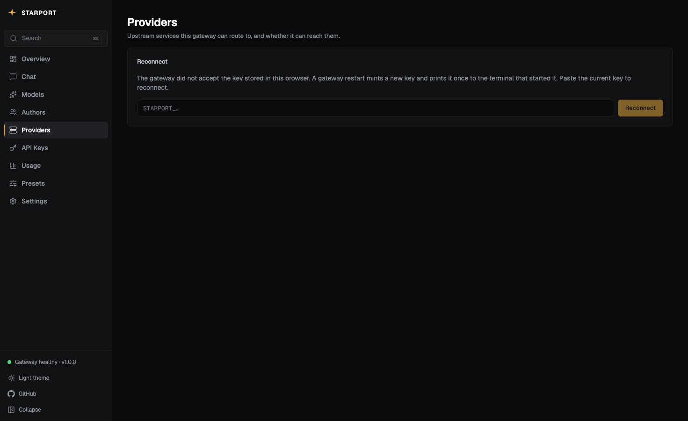
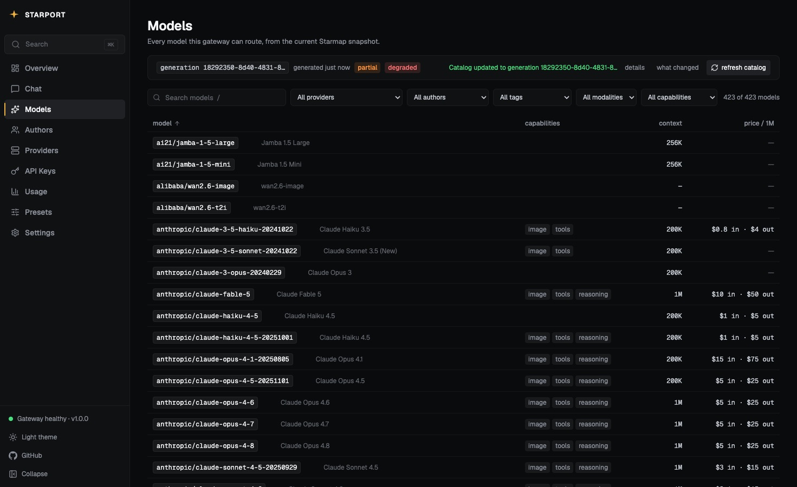

# CP20 — Development-runtime catalog refresh

The console **Refresh catalog** button returned HTTP 500 for every catalog
under `starport dev`. This record holds the root cause, the two fixes, and
the live evidence that the button now works.

## Fail-before

A refresh against the development gateway:

```
POST /api/v1/admin/catalog/refresh  ->  500
Value with size 11544986 exceeded 1048576 limit
```

## Root cause

`GenerationStore.Commit` wrote the whole encoded generation as one
key-value pair under `catalog_generation:v1:<id>`. A real Starmap catalog
encodes to about 11 MB.

Badger applies a **1 MiB per-value ceiling only when it runs in memory**
(`maxValueThreshold = 1 << 20`). A persistent Badger allows a value up to
`ValueLogFileSize`, near 1 GiB, so the same code path passed on disk and
failed in memory. `ConfigureDevelopmentRuntime`
(`internal/config/storage.go:31`) forces `inMemory: true`, so every
development refresh hit the ceiling.

Two development settings turned the defect into a total loss of the
capability rather than a degraded one:

| Setting | Development value | Effect |
|---|---|---|
| `Catalog.RefreshOnStart` | `false` | no refresh at startup |
| `Catalog.RefreshInterval` | `0` | no periodic refresh |

The console button was therefore the only trigger, and it always failed.

A second capability rode on the same defect. `/api/v1/catalog/changes`
needs two accepted generations to compare. Development could never record
a second one, so the generation-diff surface was unreachable there.

## Fix 1 — chunk the generation payload

Owner: `internal/catalog/generation_payload.go` (new),
`internal/catalog/generation_store.go`.

The generation key now holds a small descriptor. The encoded generation
lives in content-addressed chunks:

```go
type generationRecord struct {
	Encoding  string   `json:"encoding"`    // "chunked-json/1"
	Size      int      `json:"size"`
	Digest    string   `json:"digest"`      // sha256 of the whole payload
	ChunkSize int      `json:"chunk_size"`  // 256 KiB
	Chunks    []string `json:"chunks"`      // sha256 per chunk, in order
}
```

Each chunk is keyed by its own digest under
`catalog_generation:v1:chunk:<sha256>`. An 11 MB generation becomes 45
chunks of at most 256 KiB, and the descriptor stays a few kilobytes.

Properties this buys beyond fitting the backend:

- **Idempotent re-commit.** A retried commit writes the same chunk keys,
  so a partial first attempt costs nothing.
- **Cross-generation dedup.** Consecutive generations share most of their
  bytes, so most chunk writes are no-ops.
- **Cheap conflict check.** A concurrent commit is resolved by comparing
  the descriptor digest and size, not by reading 11 MB back and comparing
  bytes.

Two bounds keep the writes and reads inside backend limits.
`writeGenerationChunks` groups `BatchSet` calls under 2 MiB, because
`BatchSet` runs one Badger `db.Update` transaction and is subject to
`ErrTxnTooBig`. `readGenerationPayload` dedupes repeated digests, reads in
groups of 8, and verifies both the total length and the payload digest
before it hands bytes to the decoder.

A store written before this encoding fails by name — `declares no
encoding; the store predates chunked-json/1` — instead of decoding as an
empty catalog. A truncated store fails with `is missing chunk N of M`,
which names the gap.

### Go tests

`internal/catalog/generation_payload_test.go`, six tests:

| Test | Proves |
|---|---|
| `TestCommitAcceptsGenerationLargerThanInMemoryValueLimit` | the regression: an over-limit generation commits and reads back against a **real in-memory Badger**, with all 900 provider offerings intact |
| `TestGenerationStoreWritesNoOversizedValue` | the invariant: no stored value exceeds the chunk size, at any catalog size |
| `TestCommitIsIdempotentForIdenticalContent` | a repeated commit of the same generation succeeds |
| `TestGetReportsMissingChunk` | a truncated store names the missing chunk |
| `TestEncodeGenerationPayloadRoundTrip` | codec boundaries: empty, one byte, exact chunk, chunk plus one, several chunks, and a repeated-digest payload |
| `TestDecodeGenerationRecordRejectsForeignValue` | a pre-encoding value fails by name |

`largeTestGeneration` carries a vacuity guard. It asserts the encoded
generation exceeds 1 MiB, so a future edit cannot shrink the fixture until
it stops covering the defect.

## Fix 2 — split 401 from 403 in the console

Owner: `console/src/lib/api.ts`, `console/src/lib/useApiKey.ts`,
`console/src/components/overview/ConnectCard.tsx`, six message sites.

The gateway already separates the two states
(`internal/server/middleware.go`):

| Status | Line | Meaning |
|---|---|---|
| 401 | `:200` | no API key model in context — the key is missing, unknown, or stale |
| 403 | `:205`, `:231` | the key authenticated but lacks the required scope |

The console collapsed both into one `needsKey` flag and printed a
scope message for either. `providers.tsx:154` read **"Refresh needs an
admin-scoped key"** — the exact string a reader sees after a `starport
dev` restart strands their key, which sends them hunting for a permission
they already hold.

`accessMessage(error, scope)` now phrases them apart, and only a 401 marks
the stored key rejected. A 403 proves the key authenticated, so it must
not send the reader back to the prompt to replace a key that works.

`useHasApiKey` is replaced by `useApiKeyUsable` (a key is stored **and**
not rejected) and `useApiKeyRejected`. `ConnectCard` reads the second and
becomes a **Reconnect** prompt that names the development cause: a gateway
restart mints a new key and prints it once. The placeholder now shows the
real key shape, `STARPORT_…`.

Six sites moved to `accessMessage`: `FreshnessBar.tsx`,
`providers.tsx`, `ChangesPanel.tsx`, `presets.tsx`, `keys.tsx`, and
`models.tsx`. The provider-keys site keeps its specific 403 copy and uses
`accessMessage` only for the 401.

`console/src/lib/api.test.ts`, six tests, covers the wording of both
statuses, that a 401 sets rejection and a 403 does not, that a success or
a new key clears it, and that a 401 with no stored key says nothing about
a key.

## Live evidence

Development gateway on this build, `starport dev`, in-memory Badger:

```
POST /api/v1/admin/catalog/refresh
  HTTP 200 in 4.65s
  {"previous_generation_id":"catalog-20260822T062811Z-aac9f4ffdf74",
   "generation_id":"5fb8debf-38f4-4f34-84c0-5775f4189efa","changed":true}

GET /api/v1/models        423 models
GET /api/v1/providers      12 providers
GET /api/v1/authors       104 authors
```

A second refresh in the same process also returned 200, and
`/api/v1/catalog/changes` then reported `available:true` with from and to
generation ids — the diff surface reached for the first time under
`starport dev`.

| Shot | Shows |
|---|---|
|  | a stale key on the Providers page: the reconnect prompt with the honest cause, in place of the scope message |
|  | the refresh succeeding from the console, 423 of 423 models |

## Verification

| Check | Result |
|---|---|
| `go build ./...` | clean |
| `go vet ./...` | clean |
| `go test ./...` | EXIT=0, 45 packages |
| `make lint` | 0 issues |
| `bash scripts/verify-starmap-ownership.sh` | EXIT=0 |
| `bash scripts/verify-v1-architecture.sh` | EXIT=0 |
| `bash scripts/test-dependency-direction-verifier.sh` | EXIT=0 |
| `bash scripts/verify-dependency-direction.sh` | EXIT=0 |
| `bash scripts/verify-package-layout.sh` | EXIT=0 |
| `bash scripts/verify-readme-quickstart.sh` | EXIT=0 |
| `bash scripts/verify-openrouter-parity.sh` | EXIT=0, ORP 16/16 |
| `bash scripts/verify-catalog-performance.sh` | EXIT=0, CPV 20/20 |
| `bash scripts/verify-console-modernization.sh` | EXIT=0, CM 21/21 |
| `bash scripts/verify-catalog-driven-providers.sh` | EXIT=0, 19 passed 0 failed |
| `bash scripts/benchmark-overhead.sh` | EXIT=0, p50=0ms p99=1ms over 200 requests |
| `bash scripts/smoke-openrouter-sdks.sh` | EXIT=0, Python, TypeScript, and Go SDKs PASS |
| `pnpm test` (console) | 10 files, 71 tests passed |
| `pnpm typecheck` (console) | clean |
| `pnpm build` (console) | clean |
